# SoulLike — 기술 문서 소스

> 3인칭 소울라이크 액션 게임. Behaviour Tree 기반 몬스터 AI와 이벤트 기반 MVVM을 중심으로 구성된 1인 개발 프로젝트.
>
> 본 문서는 `Assets/` 하위의 프로젝트 스크립트 전체(외부 에셋 제외)를 읽고 실제 코드 기준으로 작성한 기술 문서 소스입니다.
> 모든 다이어그램은 Mermaid로 작성되어 있으며, 코드 위치는 `파일:줄` 형식으로 표기했습니다.

---

## 목차

| 챕터 | 내용 |
|---|---|
| [1. 프로젝트 개요](#1-프로젝트-개요) | 기술 스택, 폴더 구조, 스크립트 인벤토리 |
| [2. 전체 시스템 구조](#2-전체-시스템-구조) | 레이어 아키텍처, 핵심 클래스 관계, 런타임 부팅 순서 |
| [3. 입력 시스템](#3-입력-시스템) | Input Actions, 2단 릴레이 구조 |
| [4. 플레이어 상태 머신](#4-플레이어-상태-머신) | FSM, 상태 전이, 스태미나 |
| [5. 전투 시스템](#5-전투-시스템) | 이벤트 큐, 파이터 레지스트리 |
| [6. MVVM 데이터 계층](#6-mvvm-데이터-계층) | Observable, ViewModel, View |
| [7. 공격 판정과 무기](#7-공격-판정과-무기) | AttackTiming, 히트박스, 중복 타격 방지 |
| [8. 적 AI — Behaviour Tree](#8-적-ai--behaviour-tree) | 노드 체계, 조합 노드, 리프 노드, 트리 전문 |
| [9. 보스 시스템](#9-보스-시스템) | 2페이즈, 스킬, 쿨다운 |
| [10. 카메라와 락온](#10-카메라와-락온) | 추적, 충돌, 타겟 전환 |
| [11. 인벤토리와 장비](#11-인벤토리와-장비) | 슬롯 모델, 드래그 앤 드롭 |
| [12. 데이터 파이프라인](#12-데이터-파이프라인) | TSV 임포터, ScriptableObject DB |
| [13. 월드 인터랙션](#13-월드-인터랙션) | 화톳불, 보스방, 페이드 |
| [14. 빌드 자동화](#14-빌드-자동화) | Jenkins 연동 |
| [부록 A. 레이어 맵](#부록-a-레이어-맵) | 레이어 인덱스와 사용처 |
| [부록 B. 이벤트 인덱스](#부록-b-이벤트-인덱스) | 전체 이벤트 발신/수신 표 |
| [부록 C. 미연결 코드와 확장 포인트](#부록-c-미연결-코드와-확장-포인트) | 정의됐지만 호출되지 않는 코드 |

---

## 1. 프로젝트 개요

### 1.1 기술 스택

| 항목 | 값 |
|---|---|
| 엔진 | Unity 6000.0.56f1 |
| 렌더 파이프라인 | URP 17.0.4 |
| 입력 | Input System 1.14.2 |
| 내비게이션 | AI Navigation 2.0.8 (NavMeshAgent) |
| 비동기 | UniTask (Cysharp, git 패키지) |
| UI | uGUI 2.0.0 + TextMeshPro |
| 언어 | C# |
| IDE | Rider 2025.2.1 |
| CI | Jenkins (1시간 주기 폴링) |

### 1.2 폴더 구조

```
Assets/
├── 1_Scenes/            New Scene.unity  (단일 씬 구성)
├── 2_Scripts/           프로젝트 스크립트 전체
│   ├── Combat/          전투 코어 + MVVM
│   │   ├── Model/       CombatCalculator, FighterViewModel
│   │   └── View/        FighterView
│   ├── Enemy/           AI 베이스, 보스/스켈레톤, BT 노드
│   │   ├── Node/        BtNode, Selector, Leaf_Node
│   │   └── AttackPattern_Data/  AttackData, BossSkill
│   ├── Item/            아이템 데이터 + 인벤토리
│   │   ├── Inventory/   Inventory, UI_*
│   │   └── Item_Data/   Item, WeaponItem, DatabaseBase
│   ├── Player/          카메라, 입력, 장비, 무기
│   ├── PlayerState/     FSM 상태 클래스
│   └── Unit_Data/       FighterStats
├── 3_Prefabs/  4_Animator/
├── 10_Resources/        외부 에셋 (본 문서 범위 외)
├── 11_InputSystem/      PlayerInput.inputactions + 생성 코드
├── Editor/              BuildAuto, DatabaseEditor
├── BoneFire.cs  BossWall.cs
```

### 1.3 스크립트 인벤토리

프로젝트 스크립트 총 **5,484줄 / 60개 파일** (외부 에셋 제외). 규모 상위 항목:

| 파일 | 줄 수 | 역할 |
|---|---:|---|
| `11_InputSystem/PlayerInput.cs` | 668 | Input System 자동 생성 |
| `Enemy/Node/Leaf_Node.cs` | 505 | BT 리프 노드 10종 |
| `PlayerState/PlayerStateMachine.cs` | 309 | 플레이어 FSM 컨텍스트 |
| `Player/CameraControl.cs` | 254 | 카메라 + 락온 |
| `Item/Inventory/UI_Inventory.cs` | 223 | 드래그 앤 드롭 중재 |
| `Combat/View/FighterView.cs` | 161 | MVVM View |
| `Enemy/Node/Selector.cs` | 141 | BT 조합 노드 4종 |
| `Enemy/BossMonsterAI.cs` | 140 | 보스 트리 구성 |

---

## 2. 전체 시스템 구조

### 2.1 레이어 아키텍처

시스템은 **입력 → 상태 → 전투 → 데이터 → UI** 방향의 단방향 흐름을 갖습니다. 역방향 통신은 전부 `event` 또는 `Observable<T>`로 이루어져 하위 계층이 상위 계층을 직접 참조하지 않습니다.

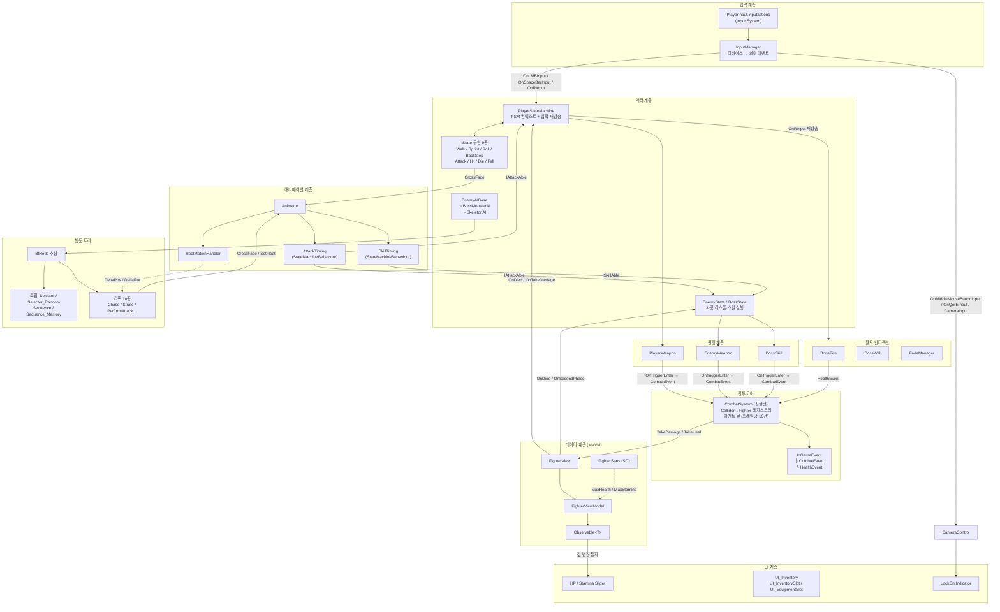
```mermaid
flowchart TB
    subgraph INPUT["입력 계층"]
        IA["PlayerInput.inputactions<br/>(Input System)"]
        IM["InputManager<br/>디바이스 → 의미 이벤트"]
    end

    subgraph ACTOR["액터 계층"]
        PSM["PlayerStateMachine<br/>FSM 컨텍스트 + 입력 재방송"]
        STATES["IState 구현 9종<br/>Walk / Sprint / Roll / BackStep<br/>Attack / Hit / Die / Fall"]
        AI["EnemyAIBase<br/>├ BossMonsterAI<br/>└ SkeletonAI"]
        ES["EnemyState / BossState<br/>사망·리스폰·스킬 실행"]
    end

    subgraph BT["행동 트리"]
        BTN["BtNode 추상"]
        COMP["조합: Selector / Selector_Random<br/>Sequence / Sequence_Memory"]
        LEAF["리프 10종<br/>Chase / Strafe / PerformAttack ..."]
    end

    subgraph ANIM["애니메이션 계층"]
        ANIMATOR["Animator"]
        AT["AttackTiming<br/>(StateMachineBehaviour)"]
        ST["SkillTiming<br/>(StateMachineBehaviour)"]
        RMH["RootMotionHandler"]
    end

    subgraph WEAPON["판정 계층"]
        PW["PlayerWeapon"]
        EW["EnemyWeapon"]
        BS["BossSkill"]
    end

    subgraph COMBAT["전투 코어"]
        CS["CombatSystem (싱글턴)<br/>Collider→Fighter 레지스트리<br/>이벤트 큐 (프레임당 10건)"]
        EV["InGameEvent<br/>├ CombatEvent<br/>└ HealthEvent"]
    end

    subgraph MVVM["데이터 계층 (MVVM)"]
        FV["FighterView"]
        FVM["FighterViewModel"]
        OBS["Observable&lt;T&gt;"]
        FS["FighterStats (SO)"]
    end

    subgraph UI["UI 계층"]
        BARS["HP / Stamina Slider"]
        INV["UI_Inventory<br/>UI_InventorySlot / UI_EquipmentSlot"]
        LOCK["LockOn Indicator"]
    end

    subgraph WORLD["월드 인터랙션"]
        BF["BoneFire"]
        BW["BossWall"]
        FM["FadeManager"]
    end

    IA --> IM
    IM -->|"OnLMBInput / OnSpaceBarInput / OnRInput"| PSM
    IM -->|"OnMiddleMouseButtonInput / OnQorEInput / CameraInput"| CAM["CameraControl"]
    PSM <--> STATES
    PSM -->|"OnRInput 재방송"| WORLD

    AI --> BTN
    BTN --> COMP
    BTN --> LEAF
    LEAF -->|"CrossFade / SetFloat"| ANIMATOR
    STATES -->|"CrossFade"| ANIMATOR
    ANIMATOR --> AT
    ANIMATOR --> ST
    ANIMATOR --> RMH
    RMH -.->|"DeltaPos / DeltaRot"| LEAF

    AT -->|"IAttackAble"| PSM
    AT -->|"IAttackAble"| ES
    ST -->|"ISkillAble"| ES
    PSM --> PW
    ES --> EW
    ES --> BS

    PW -->|"OnTriggerEnter → CombatEvent"| CS
    EW -->|"OnTriggerEnter → CombatEvent"| CS
    BS -->|"OnTriggerEnter → CombatEvent"| CS
    BF -->|"HealthEvent"| CS

    CS --> EV
    CS -->|"TakeDamage / TakeHeal"| FV
    FV --> FVM
    FVM --> OBS
    FS -.->|"MaxHealth / MaxStamina"| FVM
    OBS -->|"값 변경 통지"| BARS
    FV -->|"OnDied / OnTakeDamage"| PSM
    FV -->|"OnDied / OnSecondPhase"| ES
    CAM --> LOCK
```

### 2.2 핵심 클래스 관계

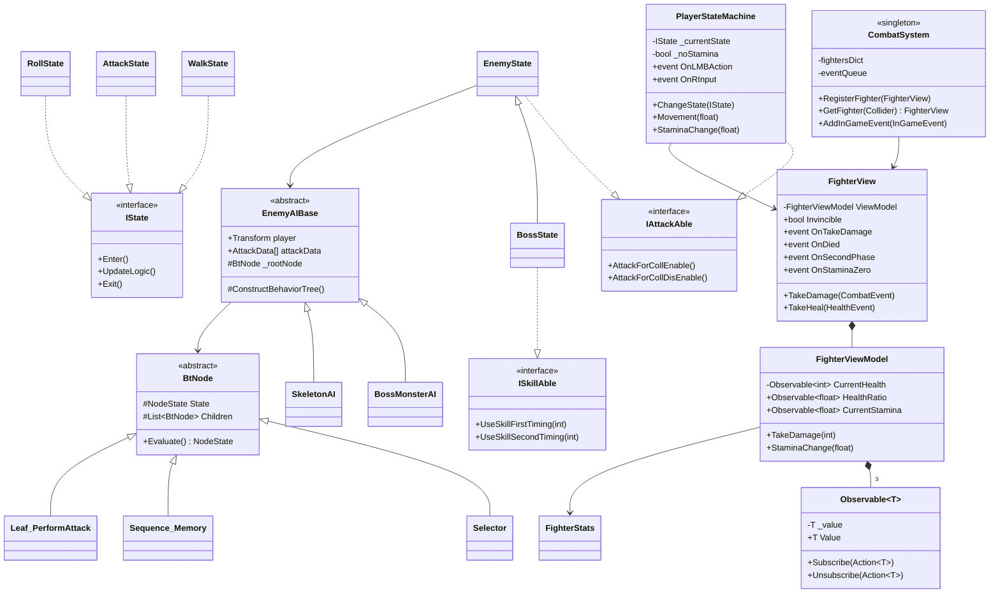
```mermaid
classDiagram
    class IState {
        <<interface>>
        +Enter()
        +UpdateLogic()
        +Exit()
    }
    class IAttackAble {
        <<interface>>
        +AttackForCollEnable()
        +AttackForCollDisEnable()
    }
    class ISkillAble {
        <<interface>>
        +UseSkillFirstTiming(int)
        +UseSkillSecondTiming(int)
    }

    class PlayerStateMachine {
        -IState _currentState
        -bool _noStamina
        +event OnLMBAction
        +event OnRInput
        +ChangeState(IState)
        +Movement(float)
        +StaminaChange(float)
    }
    class FighterView {
        -FighterViewModel ViewModel
        +bool Invincible
        +event OnTakeDamage
        +event OnDied
        +event OnSecondPhase
        +event OnStaminaZero
        +TakeDamage(CombatEvent)
        +TakeHeal(HealthEvent)
    }
    class FighterViewModel {
        -Observable~int~ CurrentHealth
        +Observable~float~ HealthRatio
        +Observable~float~ CurrentStamina
        +TakeDamage(int)
        +StaminaChange(float)
    }
    class Observable~T~ {
        -T _value
        +T Value
        +Subscribe(Action~T~)
        +Unsubscribe(Action~T~)
    }
    class CombatSystem {
        <<singleton>>
        -fightersDict
        -eventQueue
        +RegisterFighter(FighterView)
        +GetFighter(Collider) FighterView
        +AddInGameEvent(InGameEvent)
    }
    class BtNode {
        <<abstract>>
        #NodeState State
        #List~BtNode~ Children
        +Evaluate() NodeState
    }
    class EnemyAIBase {
        <<abstract>>
        +Transform player
        +AttackData[] attackData
        #BtNode _rootNode
        #ConstructBehaviorTree()
    }

    PlayerStateMachine ..|> IAttackAble
    EnemyState ..|> IAttackAble
    BossState ..|> ISkillAble
    WalkState ..|> IState
    AttackState ..|> IState
    RollState ..|> IState

    PlayerStateMachine --> FighterView
    FighterView *-- FighterViewModel
    FighterViewModel *-- "3" Observable
    FighterViewModel --> FighterStats
    CombatSystem --> FighterView
    EnemyAIBase <|-- BossMonsterAI
    EnemyAIBase <|-- SkeletonAI
    EnemyAIBase --> BtNode
    BtNode <|-- Selector
    BtNode <|-- Sequence_Memory
    BtNode <|-- Leaf_PerformAttack
    EnemyState <|-- BossState
    EnemyState --> EnemyAIBase
```

### 2.3 런타임 부팅 순서

Unity의 `Awake → Start` 순서에 의존하는 초기화 체인이 존재합니다. 특히 `CombatSystem.Instance`는 `Awake`에서 할당되고 `FighterView.Start`에서 사용되므로 **싱글턴 할당이 등록보다 반드시 먼저** 일어나야 합니다.

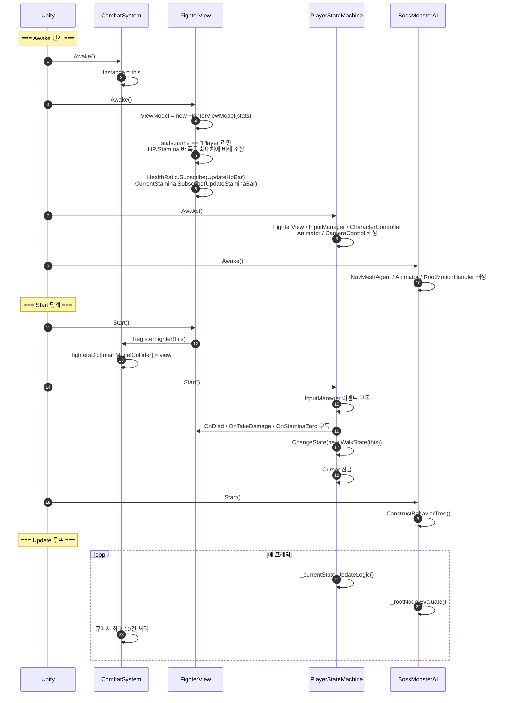
```mermaid
sequenceDiagram
    autonumber
    participant U as Unity
    participant CS as CombatSystem
    participant FV as FighterView
    participant PSM as PlayerStateMachine
    participant AI as BossMonsterAI

    Note over U: === Awake 단계 ===
    U->>CS: Awake()
    CS->>CS: Instance = this
    U->>FV: Awake()
    FV->>FV: ViewModel = new FighterViewModel(stats)
    FV->>FV: stats.name == "Player"라면<br/>HP/Stamina 바 폭을 최대치에 비례 조정
    FV->>FV: HealthRatio.Subscribe(UpdateHpBar)<br/>CurrentStamina.Subscribe(UpdateStaminaBar)
    U->>PSM: Awake()
    PSM->>PSM: FighterView / InputManager / CharacterController<br/>Animator / CameraControl 캐싱
    U->>AI: Awake()
    AI->>AI: NavMeshAgent / Animator / RootMotionHandler 캐싱

    Note over U: === Start 단계 ===
    U->>FV: Start()
    FV->>CS: RegisterFighter(this)
    CS->>CS: fightersDict[mainModelCollider] = view
    U->>PSM: Start()
    PSM->>PSM: InputManager 이벤트 구독
    PSM->>FV: OnDied / OnTakeDamage / OnStaminaZero 구독
    PSM->>PSM: ChangeState(new WalkState(this))
    PSM->>PSM: Cursor 잠금
    U->>AI: Start()
    AI->>AI: ConstructBehaviorTree()

    Note over U: === Update 루프 ===
    loop 매 프레임
        PSM->>PSM: _currentState.UpdateLogic()
        AI->>AI: _rootNode.Evaluate()
        CS->>CS: 큐에서 최대 10건 처리
    end
```

---

## 3. 입력 시스템

### 3.1 설계 의도 — 2단 릴레이

입력은 **디바이스 → 의미 → 소비자**의 2단계를 거칩니다.

1. `InputManager`가 Input System의 저수준 콜백을 **의미 있는 C# 이벤트**로 변환합니다.
2. `PlayerStateMachine`이 그중 일부를 **다시 방송**(`OnLMBAction`, `OnRInput`)합니다.

2단계가 존재하는 이유는 **상태 클래스와 월드 오브젝트가 InputManager를 몰라도 되게** 만들기 위함입니다. `WalkState`는 플레이어를 구독하고, `BoneFire`도 플레이어를 구독합니다. 덕분에 상태별 입력 구독/해제가 `Enter()`/`Exit()`에서 자연스럽게 캡슐화됩니다.

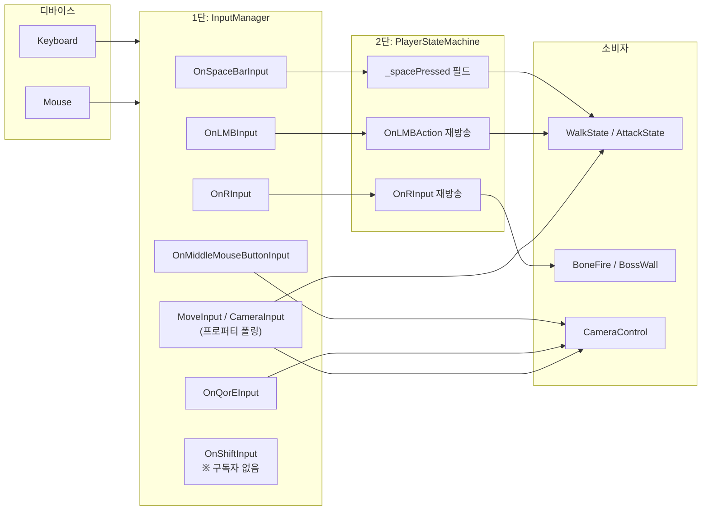
```mermaid
flowchart LR
    subgraph DEV["디바이스"]
        KB["Keyboard"]
        MS["Mouse"]
    end
    subgraph L1["1단: InputManager"]
        direction TB
        A1["OnSpaceBarInput"]
        A2["OnLMBInput"]
        A3["OnRInput"]
        A4["OnMiddleMouseButtonInput"]
        A5["OnQorEInput"]
        A6["MoveInput / CameraInput<br/>(프로퍼티 폴링)"]
        A7["OnShiftInput<br/>※ 구독자 없음"]
    end
    subgraph L2["2단: PlayerStateMachine"]
        B1["_spacePressed 필드"]
        B2["OnLMBAction 재방송"]
        B3["OnRInput 재방송"]
    end
    subgraph L3["소비자"]
        C1["WalkState / AttackState"]
        C2["BoneFire / BossWall"]
        C3["CameraControl"]
    end

    KB --> L1
    MS --> L1
    A1 --> B1 --> C1
    A2 --> B2 --> C1
    A3 --> B3 --> C2
    A4 --> C3
    A5 --> C3
    A6 --> C1
    A6 --> C3
```

### 3.2 Input Action 매핑

`Assets/11_InputSystem/PlayerInput.inputactions` — 맵 이름 `Player`

| Action | Type | 바인딩 | InputManager 출력 | 최종 소비자 |
|---|---|---|---|---|
| `Move` | PassThrough | W/A/S/D (2D Vector) | `MoveInput` 프로퍼티 | `PlayerStateMachine.Movement()` |
| `Camera` | PassThrough | Mouse Delta | `CameraInput` 프로퍼티 | `CameraControl.HandleCamera()` |
| `Roll` | Button | Space | `OnSpaceBarInput(bool)` | `_spacePressed` → Walk 분기 |
| `Attack` | Button | Mouse Left | `OnLMBInput(bool)` | `OnLMBAction` → Walk/Attack |
| `Shift` | Button | Left Shift | `OnShiftInput(bool)` | **없음** (부록 C 참조) |
| `LockOn` | Button | Mouse Middle | `OnMiddleMouseButtonInput(true)` | `CameraControl.LockOn()` |
| `Q` | Button | Q | `OnQorEInput(true)` | 좌측 타겟 전환 |
| `E` | Button | E | `OnQorEInput(false)` | 우측 타겟 전환 |
| `R` | Button | R | `OnRInput(true)` | 화톳불 / 보스방 진입 |

> **주의** — `LockOn` / `R` / `Q` / `E`는 `performed`만 구독되어 있어 **항상 `true`만 방출**합니다 (`InputManager.cs:55-65`). `CameraControl.LockOn()`이 `isPressed == false`를 조기 반환하는 것은 이 계약과 일관됩니다.

> **주의** — `Roll` 액션에 Space가 바인딩되어 있지만, 실제로 **스프린트도 같은 Space**로 동작합니다(§4.2). 액션 이름과 실제 책임이 어긋나 있습니다.

---

## 4. 플레이어 상태 머신

### 4.1 구조

`PlayerStateMachine`(`PlayerState/PlayerStateMachine.cs`)은 **컨텍스트 겸 파사드**입니다. 상태 클래스는 순수 C# 객체(`MonoBehaviour` 아님)이며, 매 전이마다 `new`로 생성됩니다.

- 상태는 플레이어의 `public` 프로퍼티(`WalkSpeed`, `NoStamina`, `MoveAmount`, `Animator` …)로만 컨텍스트에 접근합니다.
- `ChangeState()`는 `Exit() → 교체 → Enter()` 순서를 보장합니다 (`PlayerStateMachine.cs:129`).

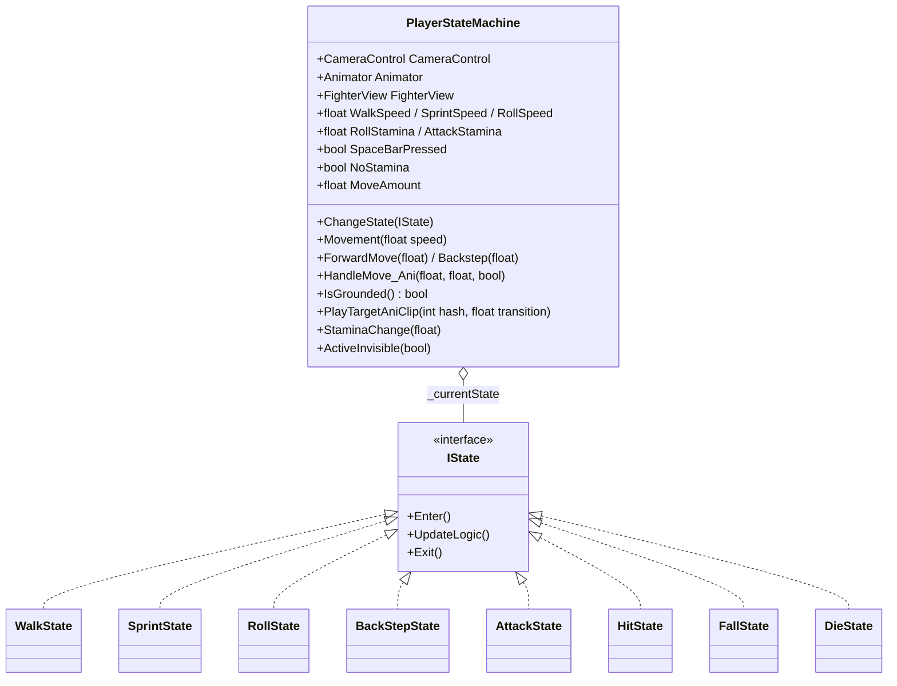
```mermaid
classDiagram
    class PlayerStateMachine {
        +CameraControl CameraControl
        +Animator Animator
        +FighterView FighterView
        +float WalkSpeed / SprintSpeed / RollSpeed
        +float RollStamina / AttackStamina
        +bool SpaceBarPressed
        +bool NoStamina
        +float MoveAmount
        +ChangeState(IState)
        +Movement(float speed)
        +ForwardMove(float) / Backstep(float)
        +HandleMove_Ani(float, float, bool)
        +IsGrounded() bool
        +PlayTargetAniClip(int hash, float transition)
        +StaminaChange(float)
        +ActiveInvisible(bool)
    }
    class IState {
        <<interface>>
        +Enter()
        +UpdateLogic()
        +Exit()
    }
    PlayerStateMachine o-- IState : _currentState
    IState <|.. WalkState
    IState <|.. SprintState
    IState <|.. RollState
    IState <|.. BackStepState
    IState <|.. AttackState
    IState <|.. HitState
    IState <|.. FallState
    IState <|.. DieState
```

### 4.2 상태 전이도

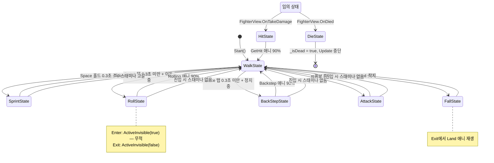
```mermaid
stateDiagram-v2
    [*] --> WalkState : Start()

    WalkState --> SprintState : Space 홀드 0.3초 초과
    WalkState --> RollState : Space 탭 0.3초 미만 + 이동 중
    WalkState --> BackStepState : Space 탭 0.3초 미만 + 정지 중
    WalkState --> AttackState : 좌클릭
    WalkState --> FallState : IsGrounded 실패

    SprintState --> WalkState : Space 해제
    SprintState --> WalkState : 스태미나 고갈

    RollState --> WalkState : Rolling 애니 90%
    BackStepState --> WalkState : Backstep 애니 90%
    AttackState --> WalkState : 콤보 종료
    FallState --> WalkState : 착지
    HitState --> WalkState : GetHit 애니 90%

    RollState --> WalkState : 진입 시 스태미나 없음
    BackStepState --> WalkState : 진입 시 스태미나 없음
    AttackState --> WalkState : 진입 시 스태미나 없음

    state "임의 상태" as ANY
    ANY --> HitState : FighterView.OnTakeDamage
    ANY --> DieState : FighterView.OnDied
    DieState --> [*] : _isDead = true, Update 중단

    note right of RollState
        Enter: ActiveInvisible(true) — 무적
        Exit: ActiveInvisible(false)
    end note
    note right of FallState
        Exit에서 Land 애니 재생
    end note
```

### 4.3 Space 키 분기 로직

`WalkState`는 하나의 Space 키로 **3가지 행동**을 구분합니다. 타이머는 `WalkState`의 로컬 필드이며 `Exit()`에서 0으로 초기화됩니다 (`WalkState.cs:51`).

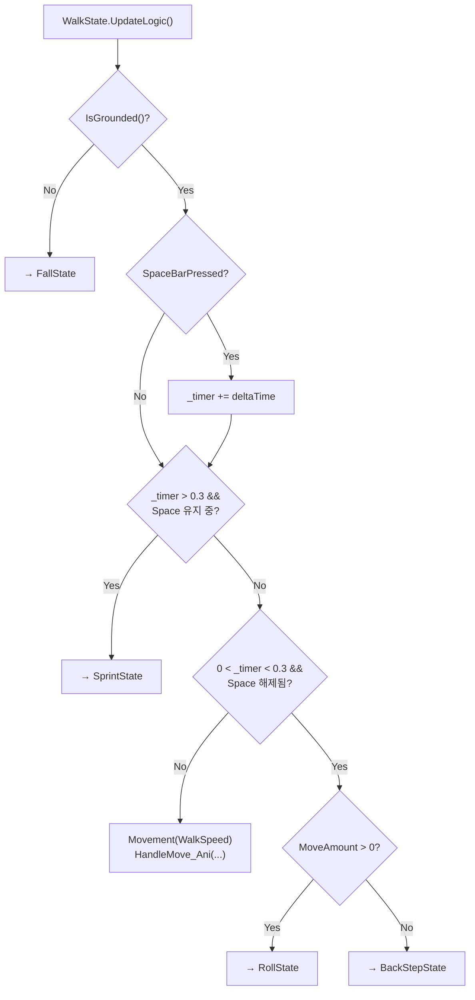
```mermaid
flowchart TD
    START["WalkState.UpdateLogic()"] --> GND{"IsGrounded()?"}
    GND -->|No| FALL["→ FallState"]
    GND -->|Yes| HOLD{"SpaceBarPressed?"}
    HOLD -->|Yes| TICK["_timer += deltaTime"]
    HOLD -->|No| CHECK
    TICK --> CHECK{"_timer > 0.3 &&<br/>Space 유지 중?"}
    CHECK -->|Yes| SPRINT["→ SprintState"]
    CHECK -->|No| TAP{"0 &lt; _timer &lt; 0.3 &&<br/>Space 해제됨?"}
    TAP -->|No| MOVE["Movement(WalkSpeed)<br/>HandleMove_Ani(...)"]
    TAP -->|Yes| DIR{"MoveAmount > 0?"}
    DIR -->|Yes| ROLL["→ RollState"]
    DIR -->|No| BACK["→ BackStepState"]
```

### 4.4 공격 콤보

3타 콤보. 각 타의 **애니메이션 90% 지점**에서 다음 타 진입 여부를 판정합니다. 선입력은 `OnLMBAction` 구독으로 미리 플래그를 세워 받습니다 (`AttackState.cs:102-116`).

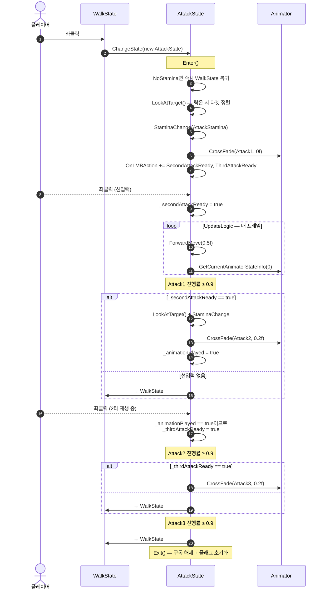
```mermaid
sequenceDiagram
    autonumber
    actor P as 플레이어
    participant WS as WalkState
    participant AS as AttackState
    participant AN as Animator

    P->>WS: 좌클릭
    WS->>AS: ChangeState(new AttackState)
    Note over AS: Enter()
    AS->>AS: NoStamina면 즉시 WalkState 복귀
    AS->>AS: LookAtTarget() — 락온 시 타겟 정렬
    AS->>AS: StaminaChange(AttackStamina)
    AS->>AN: CrossFade(Attack1, 0f)
    AS->>AS: OnLMBAction += SecondAttackReady, ThirdAttackReady

    P-->>AS: 좌클릭 (선입력)
    AS->>AS: _secondAttackReady = true

    loop UpdateLogic — 매 프레임
        AS->>AS: ForwardMove(0.5f)
        AS->>AN: GetCurrentAnimatorStateInfo(0)
    end

    Note over AS: Attack1 진행률 ≥ 0.9
    alt _secondAttackReady == true
        AS->>AS: LookAtTarget() + StaminaChange
        AS->>AN: CrossFade(Attack2, 0.2f)
        AS->>AS: _animationPlayed = true
    else 선입력 없음
        AS->>WS: → WalkState
    end

    P-->>AS: 좌클릭 (2타 재생 중)
    AS->>AS: _animationPlayed == true이므로<br/>_thirdAttackReady = true

    Note over AS: Attack2 진행률 ≥ 0.9
    alt _thirdAttackReady == true
        AS->>AN: CrossFade(Attack3, 0.2f)
    else
        AS->>WS: → WalkState
    end

    Note over AS: Attack3 진행률 ≥ 0.9
    AS->>WS: → WalkState
    Note over AS: Exit() — 구독 해제 + 플래그 초기화
```

**3타 진입 조건의 미묘한 점**: `ThirdAttackReady`는 `_animationPlayed`가 `true`일 때만 플래그를 세웁니다 (`AttackState.cs:112`). 즉 **2타 모션이 시작된 이후의 클릭만** 3타로 이어집니다. 1타 도중 두 번 연타해도 3타는 예약되지 않습니다.

### 4.5 스태미나

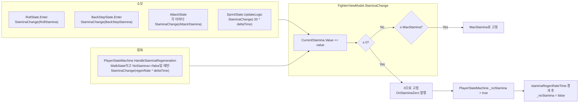
```mermaid
flowchart LR
    subgraph CONSUME["소모"]
        R["RollState.Enter<br/>StaminaChange(RollStamina)"]
        B["BackStepState.Enter<br/>StaminaChange(BackStepStamina)"]
        A["AttackState<br/>각 타마다 StaminaChange(AttackStamina)"]
        S["SprintState.UpdateLogic<br/>StaminaChange(-20 * deltaTime)"]
    end
    subgraph MODEL["FighterViewModel.StaminaChange"]
        ADD["CurrentStamina.Value += value"]
        Z{"≤ 0?"}
        C{"≥ MaxStamina?"}
    end
    subgraph REGEN["회복"]
        RG["PlayerStateMachine.HandleStaminaRegeneration<br/>WalkState이고 NoStamina==false일 때만<br/>StaminaChange(regenRate * deltaTime)"]
    end

    CONSUME --> ADD
    REGEN --> ADD
    ADD --> Z
    Z -->|Yes| ZERO["0으로 고정<br/>OnStaminaZero 발행"]
    Z -->|No| C
    C -->|Yes| CAP["MaxStamina로 고정"]
    ZERO --> LOCK["PlayerStateMachine._noStamina = true"]
    LOCK --> TIMER["staminaRegenRateTime 경과 후<br/>_noStamina = false"]
```

> **설계 계약** — `StaminaChange()`는 값을 **가산**합니다 (`FighterViewModel.cs:61`). 따라서 인스펙터의 `rollStamina` / `backStepStamina` / `attackStamina`는 **반드시 음수**로 설정해야 소모로 동작합니다. 양수를 넣으면 조용히 회복됩니다.

> **탈진 락** — `_noStamina`가 `true`인 동안 회복이 중단되고(`PlayerStateMachine.cs:263`), `staminaRegenRateTime`이 지나야 해제됩니다. 소울라이크 특유의 "탈진 페널티"를 구현한 부분입니다.

---

## 5. 전투 시스템

### 5.1 설계 의도

`CombatSystem`(`Combat/CombatSystem.cs`)은 **싱글턴 중재자**로, 두 가지 책임을 가집니다.

1. **레지스트리** — `Collider → FighterView` 사전. 무기의 `OnTriggerEnter`가 맞은 콜라이더로부터 피격 대상을 **`GetComponent` 없이** 역참조합니다.
2. **이벤트 큐** — 모든 피해/회복을 즉시 적용하지 않고 큐에 쌓아 `Update`에서 **프레임당 최대 10건**만 처리합니다 (`Max_Event_Count = 10`).

큐를 두는 이유는 대미지 적용 시점을 한 곳으로 모아 **처리 순서를 결정론적으로** 만들고, 다수 히트가 한 프레임에 몰릴 때 부하를 분산하기 위함입니다.

### 5.2 이벤트 큐 처리

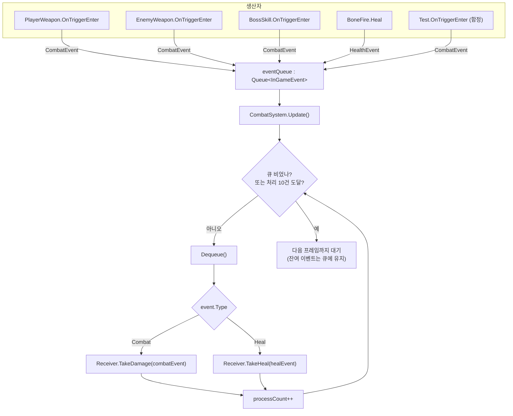
```mermaid
flowchart TD
    subgraph PRODUCER["생산자"]
        PW["PlayerWeapon.OnTriggerEnter"]
        EW["EnemyWeapon.OnTriggerEnter"]
        BS["BossSkill.OnTriggerEnter"]
        BF["BoneFire.Heal"]
        TS["Test.OnTriggerEnter (함정)"]
    end

    PW -->|CombatEvent| Q
    EW -->|CombatEvent| Q
    BS -->|CombatEvent| Q
    BF -->|HealthEvent| Q
    TS -->|CombatEvent| Q

    Q["eventQueue : Queue&lt;InGameEvent&gt;"]

    Q --> UP["CombatSystem.Update()"]
    UP --> LOOP{"큐 비었나?<br/>또는 처리 10건 도달?"}
    LOOP -->|"아니오"| DQ["Dequeue()"]
    DQ --> SW{"event.Type"}
    SW -->|Combat| TD["Receiver.TakeDamage(combatEvent)"]
    SW -->|Heal| TH["Receiver.TakeHeal(healEvent)"]
    TD --> INC["processCount++"]
    TH --> INC
    INC --> LOOP
    LOOP -->|"예"| END["다음 프레임까지 대기<br/>(잔여 이벤트는 큐에 유지)"]
```

### 5.3 이벤트 타입 계층

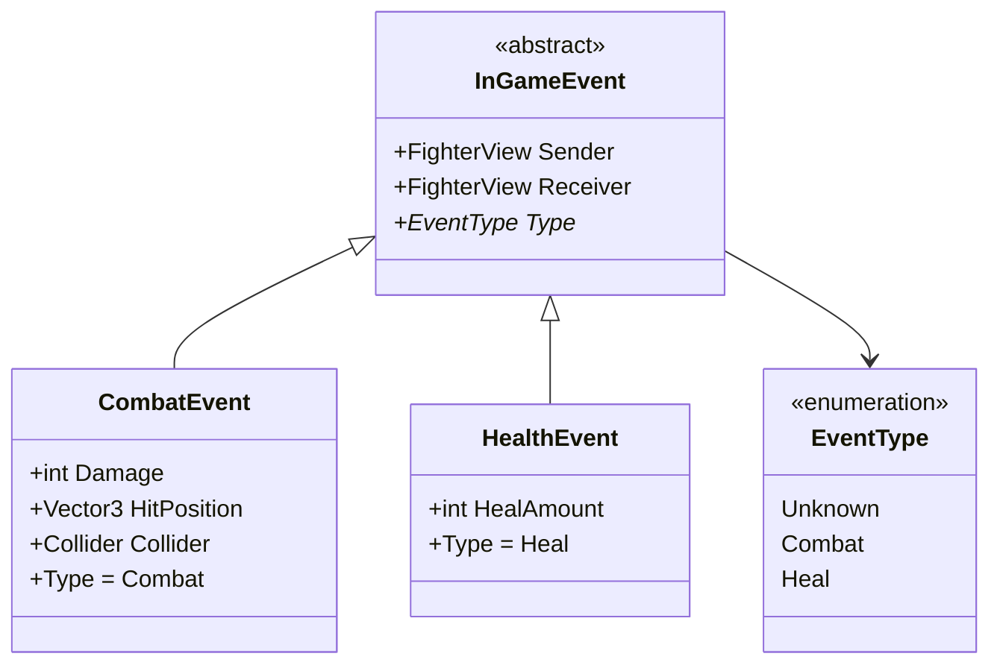
```mermaid
classDiagram
    class InGameEvent {
        <<abstract>>
        +FighterView Sender
        +FighterView Receiver
        +EventType Type*
    }
    class EventType {
        <<enumeration>>
        Unknown
        Combat
        Heal
    }
    class CombatEvent {
        +int Damage
        +Vector3 HitPosition
        +Collider Collider
        +Type = Combat
    }
    class HealthEvent {
        +int HealAmount
        +Type = Heal
    }
    InGameEvent <|-- CombatEvent
    InGameEvent <|-- HealthEvent
    InGameEvent --> EventType
```

`HitPosition`과 `Collider`는 현재 소비되지 않지만, **히트 이펙트/데칼 스폰**을 위한 예약 필드입니다.

### 5.4 파이터 레지스트리

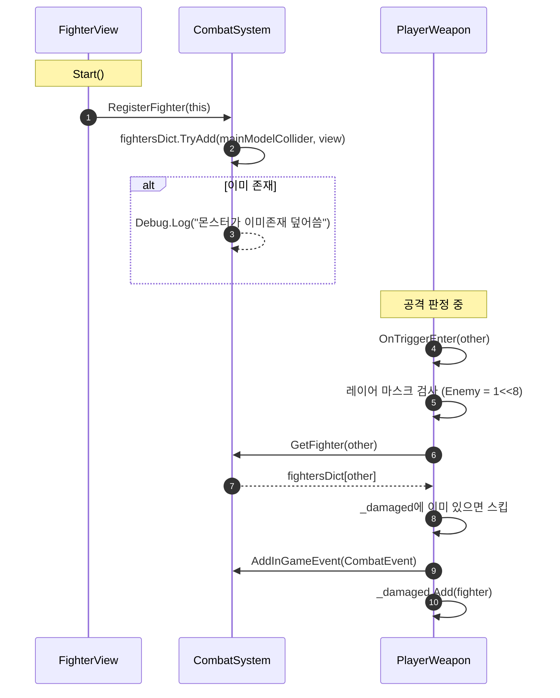
```mermaid
sequenceDiagram
    autonumber
    participant FV as FighterView
    participant CS as CombatSystem
    participant W as PlayerWeapon

    Note over FV: Start()
    FV->>CS: RegisterFighter(this)
    CS->>CS: fightersDict.TryAdd(mainModelCollider, view)
    alt 이미 존재
        CS-->>CS: Debug.Log("몬스터가 이미존재 덮어씀")
    end

    Note over W: 공격 판정 중
    W->>W: OnTriggerEnter(other)
    W->>W: 레이어 마스크 검사 (Enemy = 1<<8)
    W->>CS: GetFighter(other)
    CS-->>W: fightersDict[other]
    W->>W: _damaged에 이미 있으면 스킵
    W->>CS: AddInGameEvent(CombatEvent)
    W->>W: _damaged.Add(fighter)
```

> **주의** — `GetFighter()`는 `fightersDict[coll]` 인덱서를 그대로 사용합니다 (`CombatSystem.cs:59`). 미등록 콜라이더가 들어오면 `null`이 아니라 **`KeyNotFoundException`이 발생**합니다. 호출부의 `if (player != null)` 검사(`PlayerWeapon.cs:39`, `EnemyWeapon.cs:37`)는 도달하지 못하는 방어 코드입니다. `TryGetValue`로 바꾸면 계약이 일치합니다.

---

## 6. MVVM 데이터 계층

### 6.1 설계 의도

README에 명시된 핵심 구현 항목입니다.

> MVC 패턴보다 낮은 의존성으로 잦은 UI 및 데이터 수정에 대응 가능. 감시하는 대상의 값이 바뀌면 이벤트를 발송하는 `Observable<T>` 클래스 구현.

역할 분담은 다음과 같습니다.

| 계층 | 클래스 | 책임 | Unity 의존 |
|---|---|---|---|
| **Model** | `FighterStats` (ScriptableObject) | 최대 체력/스태미나, 힘/민첩/방어 | 데이터만 |
| **ViewModel** | `FighterViewModel` (순수 C#) | 체력·스태미나 **규칙**, 사망/페이즈 판정 | **없음** |
| **View** | `FighterView` (MonoBehaviour) | 슬라이더 갱신, 콜라이더 토글, 이벤트 중계 | 있음 |
| **바인딩** | `Observable<T>` | 값 변경 감지 + 통지 | **없음** |

`FighterViewModel`이 `MonoBehaviour`를 상속하지 않는다는 점이 핵심입니다. 전투 규칙이 씬 없이도 테스트 가능한 순수 객체로 분리되어 있습니다.

### 6.2 Observable&lt;T&gt;

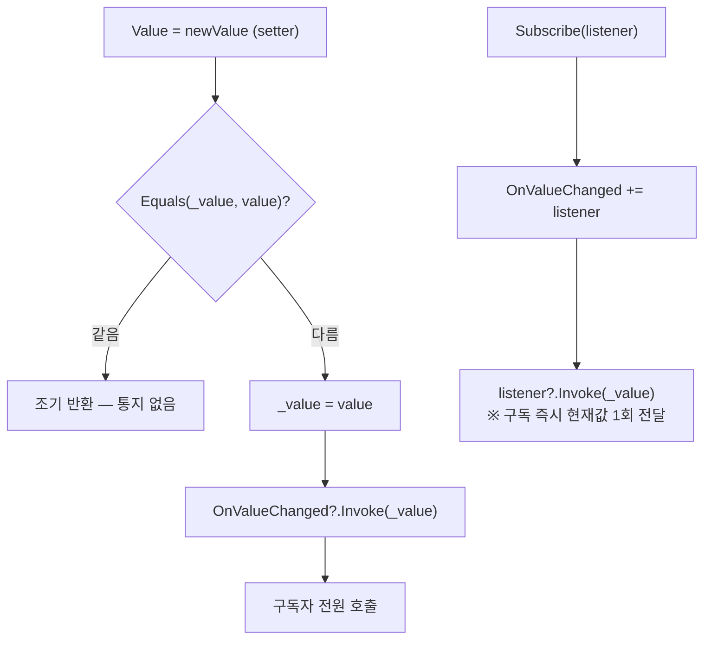
```mermaid
flowchart TD
    SET["Value = newValue (setter)"] --> EQ{"Equals(_value, value)?"}
    EQ -->|"같음"| SKIP["조기 반환 — 통지 없음"]
    EQ -->|"다름"| ASSIGN["_value = value"]
    ASSIGN --> INV["OnValueChanged?.Invoke(_value)"]
    INV --> SUB["구독자 전원 호출"]

    SUBSCRIBE["Subscribe(listener)"] --> ADD["OnValueChanged += listener"]
    ADD --> IMM["listener?.Invoke(_value)<br/>※ 구독 즉시 현재값 1회 전달"]
```

두 가지 설계 포인트가 있습니다.

- **중복 통지 차단** — `Equals` 검사로 같은 값 재대입 시 이벤트가 발생하지 않습니다 (`Observable.cs:13`).
- **구독 즉시 동기화** — `Subscribe()`가 리스너를 등록한 직후 현재값으로 한 번 호출합니다 (`Observable.cs:27`). UI가 별도 초기화 코드 없이 올바른 초기 상태를 갖게 됩니다.

### 6.3 피격 전체 시퀀스

무기 충돌부터 UI 갱신까지의 전 경로입니다.

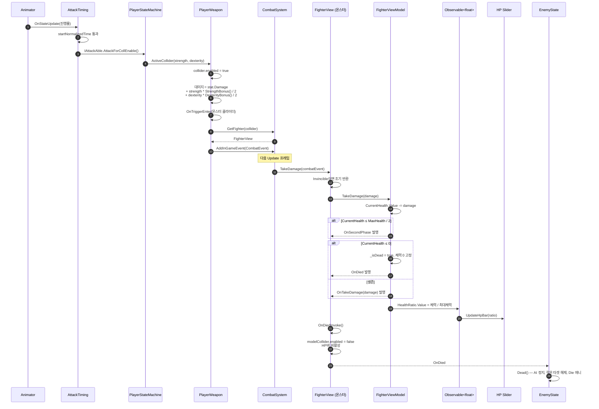
```mermaid
sequenceDiagram
    autonumber
    participant AN as Animator
    participant AT as AttackTiming
    participant PSM as PlayerStateMachine
    participant PW as PlayerWeapon
    participant CS as CombatSystem
    participant FV as FighterView (몬스터)
    participant VM as FighterViewModel
    participant OB as Observable<float>
    participant UI as HP Slider
    participant ES as EnemyState

    AN->>AT: OnStateUpdate(진행률)
    AT->>AT: startNormalizedTime 통과
    AT->>PSM: IAttackAble.AttackForCollEnable()
    PSM->>PW: ActiveCollider(strength, dexterity)
    PW->>PW: collider.enabled = true
    PW->>PW: 대미지 = stat.Damage<br/>+ strength * StrengthBonus() / 2<br/>+ dexterity * DexterityBonus() / 2

    PW->>PW: OnTriggerEnter(몬스터 콜라이더)
    PW->>CS: GetFighter(collider)
    CS-->>PW: FighterView
    PW->>CS: AddInGameEvent(CombatEvent)

    Note over CS: 다음 Update 프레임
    CS->>FV: TakeDamage(combatEvent)
    FV->>FV: Invincible이면 조기 반환
    FV->>VM: TakeDamage(damage)

    VM->>VM: CurrentHealth.Value -= damage
    alt CurrentHealth ≤ MaxHealth / 2
        VM-->>FV: OnSecondPhase 발행
    end
    alt CurrentHealth ≤ 0
        VM->>VM: _isDead = true, 체력 0 고정
        VM-->>FV: OnDied 발행
    else 생존
        VM-->>FV: OnTakeDamage(damage) 발행
    end
    VM->>OB: HealthRatio.Value = 체력 / 최대체력
    OB->>UI: UpdateHpBar(ratio)

    FV->>FV: OnDiedInvoke()
    FV->>FV: modelCollider.enabled = false<br/>HP바 비활성
    FV-->>ES: OnDied
    ES->>ES: Dead() — AI 정지, 락온 타겟 해제, Die 애니
```

### 6.4 FighterViewModel 판정 규칙

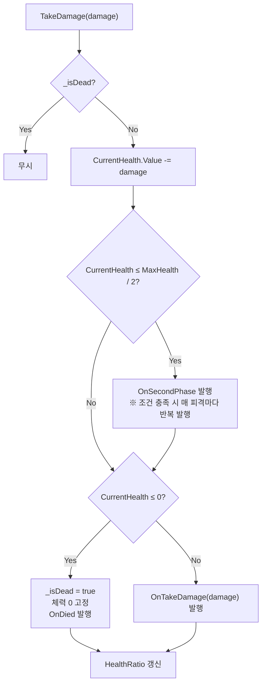
```mermaid
flowchart TD
    TD["TakeDamage(damage)"] --> DEAD{"_isDead?"}
    DEAD -->|Yes| RET["무시"]
    DEAD -->|No| SUB["CurrentHealth.Value -= damage"]
    SUB --> HALF{"CurrentHealth ≤ MaxHealth / 2?"}
    HALF -->|Yes| SP["OnSecondPhase 발행<br/>※ 조건 충족 시 매 피격마다 반복 발행"]
    HALF -->|No| ZERO
    SP --> ZERO{"CurrentHealth ≤ 0?"}
    ZERO -->|Yes| DIE["_isDead = true<br/>체력 0 고정<br/>OnDied 발행"]
    ZERO -->|No| HIT["OnTakeDamage(damage) 발행"]
    DIE --> RATIO["HealthRatio 갱신"]
    HIT --> RATIO
```

> **관찰** — `OnSecondPhase`는 체력이 절반 이하인 **모든 피격에서 반복 발행**됩니다 (`FighterViewModel.cs:40`). 수신 측이 멱등해서 문제가 드러나지 않습니다: `BossMonsterAI.SecondPhase()`는 `secondPhase = true` 대입뿐이고, `SecondParticleOn()`은 이미 켜진 파티클을 다시 켭니다. 다만 "페이즈 전환 연출을 1회만 재생"하는 요구가 생기면 `_secondPhaseTriggered` 같은 래치가 필요합니다.
>
> `TakeHeal()`에는 절반 이하 판정이 없으므로, 회복으로 절반을 넘겨도 `secondPhase`는 해제되지 않습니다 (의도된 단방향 전환으로 보입니다).

---

## 7. 공격 판정과 무기

### 7.1 설계 의도 — 애니메이션 주도 판정

히트박스 활성 타이밍을 코드 타이머가 아니라 **애니메이션 클립 자체**가 소유합니다. `AttackTiming`은 `StateMachineBehaviour`로 애니메이터 상태에 부착되며, 정규화 시간 기준으로 인터페이스를 호출합니다.

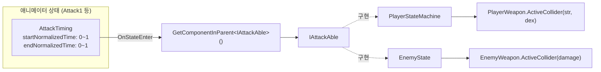
```mermaid
flowchart LR
    subgraph CLIP["애니메이터 상태 (Attack1 등)"]
        SMB["AttackTiming<br/>startNormalizedTime: 0~1<br/>endNormalizedTime: 0~1"]
    end
    SMB -->|"OnStateEnter"| RES["GetComponentInParent&lt;IAttackAble&gt;()"]
    RES --> IFACE["IAttackAble"]
    IFACE -.->|구현| PSM["PlayerStateMachine"]
    IFACE -.->|구현| ES["EnemyState"]
    PSM --> PW["PlayerWeapon.ActiveCollider(str, dex)"]
    ES --> EW["EnemyWeapon.ActiveCollider(damage)"]
```

`IAttackAble`로 추상화한 덕분에 **동일한 `AttackTiming` 컴포넌트를 플레이어와 몬스터 애니메이터가 공유**합니다. 애니메이터는 대상이 누구인지 모릅니다.

### 7.2 히트박스 생명주기

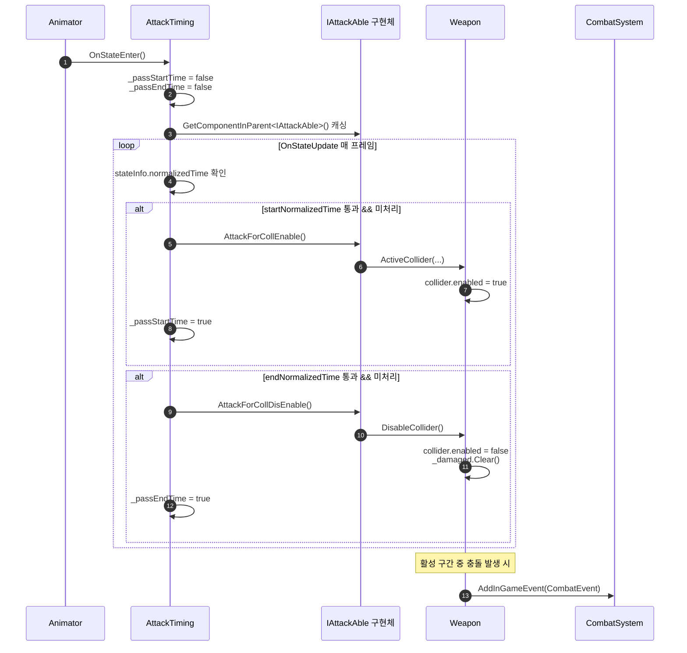
```mermaid
sequenceDiagram
    autonumber
    participant AN as Animator
    participant AT as AttackTiming
    participant OWN as IAttackAble 구현체
    participant WP as Weapon
    participant CS as CombatSystem

    AN->>AT: OnStateEnter()
    AT->>AT: _passStartTime = false<br/>_passEndTime = false
    AT->>OWN: GetComponentInParent<IAttackAble>() 캐싱

    loop OnStateUpdate 매 프레임
        AT->>AT: stateInfo.normalizedTime 확인
        alt startNormalizedTime 통과 && 미처리
            AT->>OWN: AttackForCollEnable()
            OWN->>WP: ActiveCollider(...)
            WP->>WP: collider.enabled = true
            AT->>AT: _passStartTime = true
        end
        alt endNormalizedTime 통과 && 미처리
            AT->>OWN: AttackForCollDisEnable()
            OWN->>WP: DisableCollider()
            WP->>WP: collider.enabled = false<br/>_damaged.Clear()
            AT->>AT: _passEndTime = true
        end
    end

    Note over WP: 활성 구간 중 충돌 발생 시
    WP->>CS: AddInGameEvent(CombatEvent)
```

### 7.3 중복 타격 방지

한 번의 휘두름에서 같은 대상을 여러 번 때리지 않도록 `HashSet<FighterView> _damaged`를 사용합니다. **`DisableCollider()`에서 `Clear()`** 되므로 (`PlayerWeapon.cs:31`), 다음 타에서는 같은 대상을 다시 때릴 수 있습니다 — 콤보가 정상 작동하는 이유입니다.

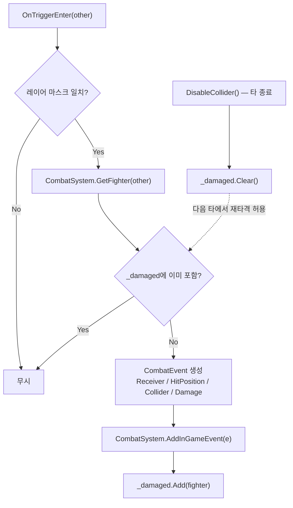
```mermaid
flowchart TD
    T["OnTriggerEnter(other)"] --> L{"레이어 마스크 일치?"}
    L -->|No| IG["무시"]
    L -->|Yes| G["CombatSystem.GetFighter(other)"]
    G --> D{"_damaged에 이미 포함?"}
    D -->|Yes| IG
    D -->|No| E["CombatEvent 생성<br/>Receiver / HitPosition / Collider / Damage"]
    E --> Q["CombatSystem.AddInGameEvent(e)"]
    Q --> ADD["_damaged.Add(fighter)"]

    DIS["DisableCollider() — 타 종료"] --> CLR["_damaged.Clear()"]
    CLR -.->|"다음 타에서 재타격 허용"| D
```

### 7.4 대미지 산식

| 주체 | 산식 | 위치 |
|---|---|---|
| 플레이어 | `stat.Damage + (strength × StrengthBonus() / 2) + (dexterity × DexterityBonus() / 2)` | `PlayerWeapon.cs:22` |
| 일반 몬스터 | `attackData[0].damage` (고정) | `EnemyState.cs:80` |
| 보스 스킬 | `attackData.damage` (프리팹별 SO) | `BossSkill.cs:30` |

무기 랭크 보너스 (`WeaponItem.cs:28-56`):

| 랭크 | 보너스 계수 |
|---|---:|
| S | 3 |
| A | 2 |
| B | 1 |

> **관찰** — `EnemyState.AttackForCollEnable()`은 항상 `attackData[0].damage`를 사용합니다 (`EnemyState.cs:80`). BT가 3타 콤보에서 서로 다른 `AttackData`를 재생하더라도 **대미지는 전부 1번 패턴의 값**이 적용됩니다. 콤보 후반타를 더 아프게 하려면 현재 실행 중인 `AttackData`의 인덱스를 `EnemyState`로 전달하는 경로가 필요합니다.

> **관찰** — `PlayerWeapon.stat`은 인스펙터에 직접 꽂는 `WeaponItem`입니다 (`PlayerWeapon.cs:8`). `PlayerEquipment.equippedWeapon`과 **연결되어 있지 않아**, 인벤토리에서 무기를 바꿔도 실제 대미지는 변하지 않습니다. 부록 C 참조.

---

## 8. 적 AI — Behaviour Tree

### 8.1 설계 의도

README의 핵심 구현 항목입니다.

> 상태가 늘어나면 전이 조건이 기하급수적으로 늘어나는 상태 패턴 대신 항상 트리구조를 유지하는 행동 트리 구현. 코드 가독성과 구현 편의성을 우선시한 재귀 방식으로 `Evaluate`를 호출하여 노드를 순회.

플레이어는 FSM, 몬스터는 BT를 쓰는 **의도적 비대칭**입니다. 플레이어의 상태 수는 유한하고 전이가 명시적인 반면, 몬스터는 "상황 판단 + 확률적 행동 선택"이 필요하기 때문입니다.

### 8.2 노드 클래스 체계

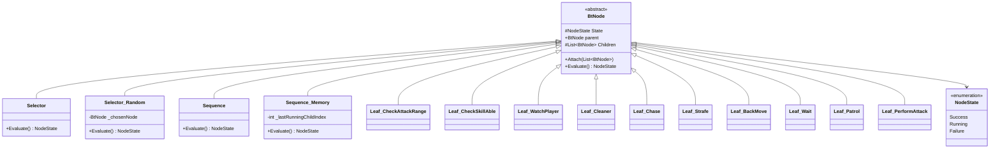
```mermaid
classDiagram
    class NodeState {
        <<enumeration>>
        Success
        Running
        Failure
    }
    class BtNode {
        <<abstract>>
        #NodeState State
        +BtNode parent
        #List~BtNode~ Children
        +Attach(List~BtNode~)
        +Evaluate() NodeState
    }

    class Selector {
        +Evaluate() NodeState
    }
    class Selector_Random {
        -BtNode _chosenNode
        +Evaluate() NodeState
    }
    class Sequence {
        +Evaluate() NodeState
    }
    class Sequence_Memory {
        -int _lastRunningChildIndex
        +Evaluate() NodeState
    }

    BtNode <|-- Selector
    BtNode <|-- Selector_Random
    BtNode <|-- Sequence
    BtNode <|-- Sequence_Memory
    BtNode <|-- Leaf_CheckAttackRange
    BtNode <|-- Leaf_CheckSkillAble
    BtNode <|-- Leaf_WatchPlayer
    BtNode <|-- Leaf_Cleaner
    BtNode <|-- Leaf_Chase
    BtNode <|-- Leaf_Strafe
    BtNode <|-- Leaf_BackMove
    BtNode <|-- Leaf_Wait
    BtNode <|-- Leaf_Patrol
    BtNode <|-- Leaf_PerformAttack
    BtNode --> NodeState
```

### 8.3 조합 노드 평가 규칙

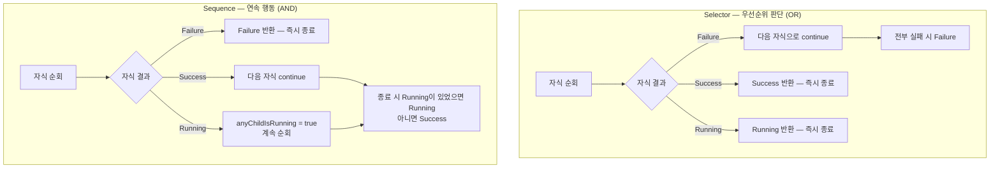
```mermaid
flowchart TB
    subgraph SEL["Selector — 우선순위 판단 (OR)"]
        S1["자식 순회"] --> S2{"자식 결과"}
        S2 -->|Failure| S3["다음 자식으로 continue"]
        S2 -->|Success| S4["Success 반환 — 즉시 종료"]
        S2 -->|Running| S5["Running 반환 — 즉시 종료"]
        S3 --> S6["전부 실패 시 Failure"]
    end

    subgraph SEQ["Sequence — 연속 행동 (AND)"]
        Q1["자식 순회"] --> Q2{"자식 결과"}
        Q2 -->|Failure| Q3["Failure 반환 — 즉시 종료"]
        Q2 -->|Success| Q4["다음 자식 continue"]
        Q2 -->|Running| Q5["anyChildIsRunning = true<br/>계속 순회"]
        Q4 --> Q6["종료 시 Running이 있었으면 Running<br/>아니면 Success"]
        Q5 --> Q6
    end
```

```mermaid
flowchart TB
    subgraph SM["Sequence_Memory — 실행 위치 기억"]
        M1["Evaluate()"] --> M2{"이전 State가<br/>Running이었나?"}
        M2 -->|No| M3["_lastRunningChildIndex = 0<br/>처음부터"]
        M2 -->|Yes| M4["기억한 인덱스에서 재개"]
        M3 --> M5["for i = index → Count"]
        M4 --> M5
        M5 --> M6{"자식 결과"}
        M6 -->|Failure| M7["인덱스 0으로 초기화<br/>Failure 반환"]
        M6 -->|Success| M8["다음 자식 continue"]
        M6 -->|Running| M9["_lastRunningChildIndex = i<br/>Running 반환"]
        M8 --> M10["전부 성공 시<br/>인덱스 초기화 + Success"]
    end

    subgraph SR["Selector_Random — 확률적 선택"]
        R1["Evaluate()"] --> R2{"State != Running<br/>또는 _chosenNode == null?"}
        R2 -->|Yes| R3["Random.Range로 자식 하나 선택"]
        R2 -->|No| R4["직전 선택 유지"]
        R3 --> R5["_chosenNode.Evaluate()"]
        R4 --> R5
        R5 --> R6{"결과가 Running?"}
        R6 -->|No| R7["_chosenNode = null<br/>다음 평가 시 재추첨"]
        R6 -->|Yes| R8["선택 유지 — 행동 지속"]
    end
```

**`Sequence`와 `Sequence_Memory`의 차이가 이 프로젝트의 핵심 이슈 해결 지점**입니다. README에 기록된 내용과 코드가 대응합니다.

> **이슈: 콤보가 끊기는 버그**
> - 문제: 적 AI가 콤보 도중 플레이어가 사거리를 벗어나면 콤보를 마무리하지 않고 끊김
> - 원인: 한 가지에 시퀀스가 2개 이어질 때 앞 시퀀스가 실패하면 뒤에서 실행 중이던 시퀀스도 즉시 끊김
> - 해결: 인덱스로 실행 중인 자식을 기억하고, 다음 프레임에 Running이면 그 인덱스에서 재개 → `Sequence_Memory`

`Sequence`는 매 프레임 **처음부터 전 자식을 재평가**하므로, 콤보 3타 중 2타 진행 중에 `CheckAttackRange`가 실패하면 트리 전체가 무너집니다. `Sequence_Memory`는 `_lastRunningChildIndex` 덕분에 진입 검사를 건너뛰고 진행 중인 타부터 이어갑니다 (`Selector.cs:114`).

> **이슈: 걷기 애니메이션 재생 버그**
> - 문제: `Vertical` 파라미터가 1로 남아 정지 상태에서도 걷기 모션 재생
> - 원인: 추격 노드에서 파라미터를 0으로 되돌리는 로직이 셀렉터 우선순위에 막혀 실행되지 않음
> - 해결: 애니메이터/NavMeshAgent 초기화를 전담하는 `Cleaner` 노드 도입

`Leaf_Cleaner`(`Leaf_Node.cs:44`)는 `Vertical`/`Horizontal`을 0으로, `agent.isStopped = true`, `ResetPath()`를 수행하고 항상 `Success`를 반환합니다. **부수효과 전용 노드**로 시퀀스 중간에 삽입해 상태를 정리합니다.

### 8.4 리프 노드 카탈로그

| 노드 | 반환 규칙 | 부수효과 | 위치 |
|---|---|---|---|
| `Leaf_CheckAttackRange` | 거리 ≤ range → Success, 아니면 Failure | 없음 (순수 조건) | `Leaf_Node.cs:14` |
| `Leaf_CheckSkillAble` | `secondPhase && !skillCool` → Success | **`skillCool = true` 설정** | `Leaf_Node.cs:68` |
| `Leaf_WatchPlayer` | 시야각·거리·레이캐스트 통과 → Success | `enemy.findPlayer = true` (래치) | `Leaf_Node.cs:446` |
| `Leaf_Cleaner` | 항상 Success | 애니 파라미터 0, agent 정지·경로 리셋 | `Leaf_Node.cs:44` |
| `Leaf_Chase` | 3초 경과 → Success, 그전엔 Running | `SetDestination(target)`, `Vertical = 1` | `Leaf_Node.cs:152` |
| `Leaf_Strafe` | `strafeDuration` 경과 → Success | 좌/우 랜덤 방향 원형 이동, 타겟 주시 | `Leaf_Node.cs:92` |
| `Leaf_BackMove` | 2초 경과 → Success | 타겟 주시하며 후진 | `Leaf_Node.cs:239` |
| `Leaf_Wait` | 1초 경과 → Success | 경로 리셋 | `Leaf_Node.cs:205` |
| `Leaf_Patrol` | 목적지 도달 → Success | 순찰 지점 순환 | `Leaf_Node.cs:399` |
| `Leaf_PerformAttack` | 전체 시간 경과 → Success | 애니 CrossFade, 루트모션/수동 전진 | `Leaf_Node.cs:292` |

**`Leaf_WatchPlayer`의 래치 동작** — 한 번 플레이어를 발견하면 `findPlayer = true`가 유지되어 이후 무조건 `Success`를 반환합니다 (`Leaf_Node.cs:468`). 즉 **한 번 어그로가 끌리면 시야에서 벗어나도 풀리지 않습니다.** 해제는 `EnemyAIBase.Respawn()`에서만 일어납니다 (`EnemyAIBase.cs:60`). 소울라이크의 "발각되면 끝까지 쫓아온다" 특성과 일치하지만, 어그로 해제 요구가 생기면 이 지점을 수정해야 합니다.

**`Leaf_CheckSkillAble`은 순수 조건이 아닙니다** — 성공 시 `skillCool = true`를 세팅합니다 (`Leaf_Node.cs:81`). 조건 노드가 상태를 변경하므로, 이 노드를 트리에서 재사용하거나 위치를 옮기면 쿨다운이 예기치 않게 소모됩니다.

### 8.5 Leaf_PerformAttack — 3구간 타임라인

공격을 **선딜 → 타격 → 후딜**의 3구간으로 나누고, `AttackData`(ScriptableObject)가 각 구간 길이를 소유합니다. 이 구조가 README의 "공격 템포를 조절할 줄 아는 AI"의 실체입니다.

```mermaid
flowchart LR
    A["_isAttacking == false<br/>→ 진입 초기화<br/>_timer = 0"] --> T["_timer += deltaTime"]
    T --> B{"_timer &lt; windupTime?"}
    B -->|Yes| C["RotateTowardsTarget()<br/>Slerp 조준 보정"] --> R1["Running"]
    B -->|No| D{"_timer &lt;<br/>windup + active?"}
    D -->|Yes| E["최초 1회만<br/>CrossFade(animTrigger, 0f)"]
    E --> F{"useRoot?"}
    F -->|Yes| G["RootMotionHandler.DeltaPos/DeltaRot<br/>직접 적용, y = 0 고정"]
    F -->|No| H["forward 방향 수동 전진<br/>Lerp로 감속"]
    G --> R2["Running"]
    H --> R2
    D -->|No| I{"_timer &lt;<br/>windup + active + recovery?"}
    I -->|Yes| R3["Running — 경직"]
    I -->|No| J["applyRootMotion = false<br/>_isAttacking = false"] --> S["Success"]
```

**AttackData 스키마** (`AttackPattern_Data/AttackData.cs`):

| 필드 | 용도 |
|---|---|
| `attackName` | 식별용 |
| `damage` | 대미지 (단, §7.4 관찰 참조) |
| `windupTime` | 선딜 — 이 구간엔 조준 보정만 |
| `activeTime` | 타격 구간 — 애니 재생 + 전진 |
| `recoveryTime` | 후딜 — 아무 입력도 받지 않는 경직 |
| `probability` | **현재 미사용** (`Selector_Random`이 균등 추첨) |
| `animTrigger` | `CrossFade` 대상 상태 이름 |

> **명명 주의** — `_isDamaged` 플래그(`Leaf_Node.cs:303`)는 이름과 달리 **대미지와 무관**합니다. 타격 구간에서 `CrossFade`를 1회만 호출하기 위한 가드입니다. 실제 대미지 판정은 `AttackTiming`(§7)이 담당합니다. `_animationStarted` 같은 이름이 의도를 더 잘 드러냅니다.

> **루트모션 복원** — `useRoot`인 경우 `applyRootMotion = true`를 매 프레임 세팅하고, Success 시점에 `false`로 되돌립니다 (`Leaf_Node.cs:382`). 되돌리지 않으면 이후 추격 등 다른 이동 노드가 NavMeshAgent와 충돌해 오작동합니다.

### 8.6 EnemyAIBase — 공용 노드 사전

`EnemyAIBase.ConstructBehaviorTree()`는 공용 리프를 `Dictionary<CommonNodes, BtNode>`에 미리 만들어 둡니다 (`EnemyAIBase.cs:36`). 자식 클래스는 `base.ConstructBehaviorTree()`를 호출한 뒤 `nodeDict[N.Chase]` 형태로 **인스턴스를 재사용**해 트리를 조립합니다.

```mermaid
classDiagram
    class CommonNodes {
        <<enumeration>>
        Strafe
        Chase
        CheckAttackRange
        Wait
        Cleaner
        BackMove
        WatchPlayer
        Patrol
    }
    class EnemyAIBase {
        <<abstract>>
        +Transform player
        +float attackRange
        +AttackData[] attackData
        +float viewAngle / viewDistance
        +Transform[] patrolPoint
        +bool findPlayer
        #bool IsDead
        #nodeDict
        #NavMeshAgent _agent
        #BtNode _rootNode
        #Animator _animator
        #RootMotionHandler _rootMotionHandler
        #ConstructBehaviorTree() virtual
        +Dead()
        +Respawn()
    }
    class BossMonsterAI {
        +float skillRange
        +AttackData[] skillData
        +bool secondPhase
        +bool skillCool
        +float skillTimer
        +SecondPhase()
        #ConstructBehaviorTree() override
    }
    class SkeletonAI {
        #ConstructBehaviorTree() override
    }
    EnemyAIBase <|-- BossMonsterAI
    EnemyAIBase <|-- SkeletonAI
    EnemyAIBase --> CommonNodes
```

> **인스턴스 공유 주의** — `nodeDict`의 노드는 **단일 인스턴스가 여러 부모에 붙습니다**. 예로 `nodeDict[N.Strafe]`는 보스 트리에서 `comboOrStrafeAction`과 `randomOutAction` 양쪽의 자식입니다. `Leaf_Strafe`는 `_timer`·`_isStarted`·`_strafeDirection` 같은 **내부 상태를 갖기 때문에**, 두 부모가 번갈아 평가하면 타이머를 공유하게 됩니다. 현재는 한 프레임에 한 경로만 활성화되어 문제가 드러나지 않지만, 트리를 확장할 때 주의가 필요한 구조적 제약입니다.

### 8.7 SkeletonAI 행동 트리

일반 몬스터. **순찰 → 발견 → 교전**의 흐름을 갖습니다.

```mermaid
flowchart TD
    ROOT["action<br/><b>Selector</b>"]

    ROOT --> FA["findAndAttack<br/><b>Sequence_Memory</b>"]
    ROOT --> PS["patrolSequence<br/><b>Sequence_Memory</b>"]

    FA --> WP["Leaf_WatchPlayer<br/>시야각·거리·레이캐스트<br/>발견 시 findPlayer 래치"]
    FA --> MOA["moveOrAttack<br/><b>Selector</b>"]

    MOA --> COSA["comboOrStrafeAction<br/><b>Selector_Random</b><br/>4개 중 균등 추첨"]
    MOA --> ROA["randomOutAction<br/><b>Selector_Random</b>"]

    COSA --> FC["fullComboSequence<br/><b>Sequence_Memory</b>"]
    COSA --> HC["halfComboSequence<br/><b>Sequence_Memory</b>"]
    COSA --> ISS["innerStrafeSequence<br/><b>Sequence_Memory</b>"]
    COSA --> BWC["backWalkCheck<br/><b>Sequence_Memory</b>"]

    FC --> FC1["CheckAttackRange"] --> FC2["Cleaner"] --> FC3["PerformAttack[0]"] --> FC4["PerformAttack[1]"] --> FC5["PerformAttack[2]"]
    HC --> HC1["CheckAttackRange"] --> HC2["Cleaner"] --> HC3["PerformAttack[0]"] --> HC4["PerformAttack[1]"]
    ISS --> IS1["CheckAttackRange"] --> IS2["Cleaner"] --> IS3["Strafe"]
    BWC --> BW1["CheckAttackRange"] --> BW2["Cleaner"] --> BW3["backMoveAndWait<br/><b>Sequence_Memory</b>"]
    BW3 --> BW4["BackMove (2초)"] --> BW5["Wait (1초)"]

    ROA --> WC["walkCheck<br/><b>Selector</b>"]
    ROA --> ST2["Strafe"]
    WC --> WC1["CheckAttackRange<br/>사거리 안이면 Success로 조기 종료"]
    WC --> OOR["outOfRangeAction<br/><b>Sequence_Memory</b>"]
    OOR --> OOR1["Chase (3초)"] --> OOR2["Wait (1초)"]

    PS --> PS1["Patrol"] --> PS2["Wait (1초)"]

    style ROOT fill:#2d3748,color:#fff
    style FA fill:#2c5282,color:#fff
    style MOA fill:#2c5282,color:#fff
    style COSA fill:#553c9a,color:#fff
    style ROA fill:#553c9a,color:#fff
```

**핵심 흐름**: `Selector`인 루트는 `findAndAttack`을 먼저 시도합니다. `Leaf_WatchPlayer`가 실패하면(= 아직 미발견) `patrolSequence`로 폴백해 순찰합니다. 한 번 발견되면 `findPlayer` 래치 때문에 `findAndAttack`이 항상 진입하고, **순찰로 되돌아가지 않습니다.**

**교전 시 4지선다**: `comboOrStrafeAction`이 3타 콤보 / 2타 콤보 / 견제 스트레이프 / 후퇴 후 대기 중 하나를 균등 추첨합니다. 4개 분기 모두 `CheckAttackRange`로 시작하므로, **사거리 밖이면 전부 실패**하고 `moveOrAttack` Selector가 `randomOutAction`으로 넘어가 접근합니다.

### 8.8 BossMonsterAI 행동 트리

보스. 스켈레톤 대비 **스킬 분기와 2페이즈**가 추가됩니다.

```mermaid
flowchart TD
    ROOT["actions<br/><b>Selector</b>"]

    ROOT --> SOC["skillOrCombo<br/><b>Selector</b>"]
    ROOT --> ROA["randomOutAction<br/><b>Selector_Random</b>"]

    SOC --> SUS["skillUseSequence<br/><b>Sequence_Memory</b>"]
    SOC --> AA["a — 근접 교전<br/><b>Sequence_Memory</b>"]

    SUS --> SR["CheckAttackRange @ skillRange<br/>(근접보다 넓은 범위)"]
    SUS --> SA["Leaf_CheckSkillAble<br/>secondPhase && !skillCool<br/>성공 시 skillCool = true"]
    SUS --> SC["Cleaner"]
    SUS --> SRA["skillRangeAction<br/><b>Selector_Random</b>"]
    SRA --> SK0["PerformAttack skillData[0]<br/>useRoot = true"]
    SRA --> SK1["PerformAttack skillData[1]<br/>useRoot = true"]

    AA --> AR["CheckAttackRange @ attackRange"]
    AA --> AC["Cleaner"]
    AA --> COSA["comboOrStrafeAction<br/><b>Selector_Random</b>"]

    COSA --> FC["fullComboSequence<br/><b>Sequence_Memory</b><br/>atk0 → atk1 → atk2"]
    COSA --> HC["halfComboSequence<br/><b>Sequence_Memory</b><br/>atk0 → atk1"]
    COSA --> ST["Strafe"]
    COSA --> BMW["backMoveAndWait<br/><b>Sequence_Memory</b><br/>BackMove → Wait"]

    ROA --> WC["walkCheck<br/><b>Selector</b>"]
    ROA --> ST2["Strafe"]
    WC --> WC1["CheckAttackRange"]
    WC --> OOR["outOfRangeAction<br/><b>Sequence_Memory</b><br/>Chase → Wait"]

    style ROOT fill:#2d3748,color:#fff
    style SOC fill:#2c5282,color:#fff
    style SUS fill:#742a2a,color:#fff
    style COSA fill:#553c9a,color:#fff
    style ROA fill:#553c9a,color:#fff
    style SRA fill:#553c9a,color:#fff
```

**스켈레톤과의 차이**:

| 항목 | SkeletonAI | BossMonsterAI |
|---|---|---|
| 발견 판정 | `Leaf_WatchPlayer` 필요 | **없음** — 등장 즉시 교전 |
| 순찰 | `patrolSequence` | 없음 |
| 스킬 | 없음 | `skillUseSequence` (2페이즈 한정) |
| 콤보 진입 검사 | 각 콤보 분기 내부 | 상위 `a` 시퀀스에서 1회 |
| 루트모션 | `useRoot = false` | 스킬만 `useRoot = true` |
| 이동 속도 인자 | `1f` | `3f` |

보스가 `Leaf_WatchPlayer`를 쓰지 않는 것은 `BossWall`로 입장 시점이 통제되기 때문입니다(§13.2).

**스킬 우선순위**: `skillOrCombo`가 `Selector`이므로 `skillUseSequence`가 **항상 먼저** 시도됩니다. 실패 조건은 (a) 스킬 사거리 밖, (b) 1페이즈, (c) 쿨다운 중 셋 중 하나이며, 실패 시 근접 교전 `a`로 넘어갑니다.

### 8.9 매 프레임 평가 사이클

```mermaid
sequenceDiagram
    autonumber
    participant U as Unity Update
    participant AI as BossMonsterAI
    participant R as 루트 Selector
    participant S as skillUseSequence
    participant C as 근접 Sequence_Memory
    participant L as 리프 노드

    U->>AI: Update()
    AI->>AI: IsDead면 조기 반환
    AI->>AI: skillCool이면 skillTimer += deltaTime
    AI->>AI: skillTimer ≥ 15초면<br/>skillCool = false, 타이머 리셋
    AI->>R: _rootNode.Evaluate()

    R->>S: skillOrCombo → skillUseSequence.Evaluate()
    S->>L: CheckAttackRange @ skillRange
    alt 스킬 사거리 밖
        L-->>S: Failure
        S-->>R: Failure
        R->>C: 근접 교전 'a'.Evaluate()
        C->>L: CheckAttackRange @ attackRange
        alt 근접 사거리 안
            L-->>C: Success
            C->>L: Cleaner → Success
            C->>L: comboOrStrafeAction (랜덤 추첨)
            L-->>C: Running (콤보 진행)
            C->>C: _lastRunningChildIndex 기록
            C-->>R: Running
        else 근접 사거리 밖
            L-->>C: Failure
            C-->>R: Failure
            R->>L: randomOutAction → Chase 또는 Strafe
        end
    else 스킬 조건 충족
        L-->>S: Success
        S->>L: CheckSkillAble → skillCool = true, Success
        S->>L: Cleaner → Success
        S->>L: skillRangeAction → 스킬 2종 중 랜덤
        L-->>S: Running
        S-->>R: Running
    end
    R-->>AI: NodeState
```

> **성능 특성** — 재귀 평가는 매 프레임 트리를 위에서부터 순회합니다. README 회고에 기록된 대로 **한 프레임 내 전 노드 순회로 인한 스파이크 가능성**이 구조적 한계이며, Stack 기반 반복문 방식이 프레임당 실행 횟수 제어에 유리합니다. 현재 규모(노드 수십 개, 몬스터 소수)에서는 실측 부하가 문제되지 않습니다.

---

## 9. 보스 시스템

### 9.1 클래스 구성

```mermaid
classDiagram
    class EnemyState {
        -bool canRespawn
        +AttackData[] attackData
        #FighterView fighterView
        #EnemyAIBase enemyAI
        -EnemyWeapon _weapon
        -Vector3 _originTransform
        -LockOnTarget _lockOnTarget
        #Dead() virtual
        +Respawn()
        #Initialized() virtual
        +AttackForCollEnable()
        +AttackForCollDisEnable()
    }
    class BossState {
        -GameObject secondPhaseParticle
        -GameObject[] skillPrefabs
        -GameObject boneFire
        -GameObject bossWall
        #Dead() override
        #Initialized() override
        -SecondParticleOn()
        +UseSkillFirstTiming(int)
        +UseSkillSecondTiming(int)
    }
    class ISkillAble {
        <<interface>>
        +UseSkillFirstTiming(int)
        +UseSkillSecondTiming(int)
    }
    class IAttackAble {
        <<interface>>
    }
    EnemyState <|-- BossState
    EnemyState ..|> IAttackAble
    BossState ..|> ISkillAble
```

`EnemyState`는 **템플릿 메서드 패턴**을 사용합니다. `Initialized()`와 `Dead()`가 `virtual`이고, `Start()`에서 `Initialized()`를 호출합니다 (`EnemyState.cs:31`). 보스는 이 훅에 페이즈 구독을 끼워 넣습니다.

### 9.2 2페이즈 전환

```mermaid
sequenceDiagram
    autonumber
    participant PW as PlayerWeapon
    participant CS as CombatSystem
    participant FV as FighterView
    participant VM as FighterViewModel
    participant BS as BossState
    participant AI as BossMonsterAI
    participant BT as 행동 트리

    Note over BS: Start() → Initialized()
    BS->>FV: OnSecondPhase += bossAI.SecondPhase
    BS->>FV: OnSecondPhase += SecondParticleOn
    BS->>BS: secondPhaseParticle.SetActive(false)

    Note over PW: 전투 중
    PW->>CS: CombatEvent
    CS->>FV: TakeDamage()
    FV->>VM: TakeDamage(damage)
    VM->>VM: CurrentHealth ≤ MaxHealth / 2 판정
    VM-->>FV: OnSecondPhase 발행
    FV-->>BS: SecondParticleOn()
    BS->>BS: 파티클 활성화
    FV-->>AI: SecondPhase()
    AI->>AI: secondPhase = true

    Note over BT: 이후 평가부터
    BT->>AI: Leaf_CheckSkillAble 확인
    AI-->>BT: secondPhase == true && skillCool == false → Success
    BT->>BT: 스킬 분기 개방
```

### 9.3 스킬 쿨다운 사이클

쿨다운은 **`Leaf_CheckSkillAble`이 잠그고 `BossMonsterAI.Update`가 푸는** 분산 구조입니다.

```mermaid
stateDiagram-v2
    [*] --> 페이즈1 : 전투 시작
    페이즈1 --> 페이즈2 : 체력 50% 이하<br/>OnSecondPhase

    state 페이즈2 {
        [*] --> 스킬가능
        스킬가능 --> 쿨다운중 : Leaf_CheckSkillAble 통과<br/>skillCool = true<br/>스킬 발동
        쿨다운중 --> 쿨다운중 : Update에서<br/>skillTimer += deltaTime
        쿨다운중 --> 스킬가능 : skillTimer ≥ 15초<br/>skillCool = false<br/>skillTimer = 0
    }

    페이즈2 --> 사망 : 체력 0
    사망 --> [*]
```

> **쿨다운 시작 시점** — `skillCool`은 스킬 **애니메이션 완료 시점이 아니라 조건 검사 통과 즉시** `true`가 됩니다. 따라서 15초 쿨다운에는 스킬 시전 시간이 포함됩니다. 실제 재사용 간격은 `15초 - (windup + active + recovery)`입니다.

### 9.4 스킬 발동 경로

`SkillTiming`(`SkillTiming.cs`)은 `AttackTiming`과 동일한 `StateMachineBehaviour` 패턴이되, **인덱스를 인자로** 넘겨 프리팹을 지정합니다. 인스펙터에서 `firstIndex`/`secondIndex`를 설정하며, `-1`은 "발동 없음"을 뜻합니다.

```mermaid
sequenceDiagram
    autonumber
    participant BT as Leaf_PerformAttack
    participant AN as Animator
    participant ST as SkillTiming
    participant BS as BossState
    participant SP as 스킬 프리팹
    participant CS as CombatSystem
    participant FV as FighterView (플레이어)

    BT->>AN: CrossFade(skillData.animTrigger, 0f)
    AN->>ST: OnStateEnter()
    ST->>BS: GetComponentInParent<ISkillAble>() 캐싱

    loop OnStateUpdate
        alt startNormalizedTime 통과
            ST->>BS: UseSkillFirstTiming(firstIndex)
            BS->>BS: firstIndex == -1이면 반환
            BS->>SP: Instantiate(skillPrefabs[firstIndex],<br/>transform.position, transform.rotation)
        end
        alt endNormalizedTime 통과
            ST->>BS: UseSkillSecondTiming(secondIndex)
            BS->>SP: Instantiate(skillPrefabs[secondIndex], ...)
        end
    end

    Note over SP: BossSkill.Start()
    SP->>SP: _playerLayer = 1 << 7
    SP->>SP: StartCoroutine(DestroyCoroutine)

    SP->>SP: OnTriggerEnter(플레이어)
    SP->>CS: GetFighter(other)
    SP->>CS: AddInGameEvent(CombatEvent{attackData.damage})
    SP->>SP: _damaged.Add(player) — 중복 방지
    CS->>FV: TakeDamage()

    Note over SP: durationTime 경과
    SP->>SP: Destroy(gameObject)
```

`UseSkillFirstTiming`과 `UseSkillSecondTiming`은 **구현이 동일**합니다 (`BossState.cs:34-52`). 하나의 스킬 모션에서 **두 번에 나눠 투사체/장판을 뿌리는** 용도(예: 1타 전방, 2타 광역)로 설계된 것으로 보입니다.

### 9.5 사망 처리

```mermaid
flowchart TD
    D["FighterView.OnDied"] --> ES["EnemyState.Dead()"]
    ES --> A1["enemyAI.Dead()<br/>IsDead = true, agent.enabled = false"]
    ES --> A2["_lockOnTarget 비활성<br/>→ 카메라 락온 자동 해제"]
    ES --> A3["CrossFade(Die, 0f)"]
    ES --> A4["_isDead = true"]

    A4 --> UP["EnemyState.Update()"]
    UP --> CH{"Die 애니 진행률 ≥ 0.9?"}
    CH -->|Yes| OFF["gameObject.SetActive(false)"]

    D --> BSD["BossState.Dead() override"]
    BSD --> B0["base.Dead() 먼저 호출"]
    BSD --> B1["secondPhaseParticle 비활성"]
    BSD --> B2["boneFire.SetActive(true)<br/>→ 화톳불 개방"]
    BSD --> B3["Destroy(bossWall)<br/>→ 보스방 봉인 해제"]

    style BSD fill:#742a2a,color:#fff
```

보스 사망이 **화톳불 활성화 + 보스벽 파괴**를 겸하므로, 진행도 게이팅이 `BossState.Dead()` 한 곳에 모여 있습니다.

---

## 10. 카메라와 락온

### 10.1 프레임 내 실행 순서

`CameraControl`은 `Update`와 `LateUpdate`에 책임을 나눠, **플레이어 이동이 끝난 뒤** 카메라를 배치합니다.

```mermaid
flowchart TD
    subgraph UPDATE["Update()"]
        HC["HandleCamera()<br/>락온 중이면 조기 반환<br/>마우스 델타 → yaw/pitch<br/>pitch를 min/max로 클램프<br/>cameraPivot.rotation 설정"]
    end
    subgraph LATE["LateUpdate() — 순서 중요"]
        FP["1. FollowPlayer()<br/>Lerp로 플레이어 추적<br/>락온 시 높이 오프셋 추가"]
        LO["2. LockOnCamControl()<br/>타겟 방향으로 피벗 회전<br/>인디케이터 스크린 좌표 갱신"]
        CC["3. CameraCollision()<br/>SphereCast로 벽 감지<br/>SmoothDamp로 카메라 당김"]
        FP --> LO --> CC
    end
    UPDATE --> LATE
```

순서가 중요한 이유: `CameraCollision()`이 `cameraPivot.position`과 `forward`를 기준으로 SphereCast를 쏘므로, **피벗의 위치(FollowPlayer)와 회전(LockOnCamControl)이 확정된 뒤에** 실행되어야 합니다.

### 10.2 락온 토글

```mermaid
flowchart TD
    IN["휠 클릭 → OnMiddleMouseButtonInput(true)"] --> P{"isPressed == false?"}
    P -->|Yes| RET["반환"]
    P -->|No| L{"이미 락온 중?"}
    L -->|Yes| UN["UnlockOn()<br/>isLockedOn = false<br/>currentTarget = null<br/>인디케이터 숨김"]
    L -->|No| SPH["Physics.OverlapSphere<br/>(transform.position, searchRadius, targetLayer)"]
    SPH --> IT["각 콜라이더에서<br/>GetComponentInChildren&lt;LockOnTarget&gt;()"]
    IT --> NEAR["가장 가까운 타겟 선정"]
    NEAR --> F{"찾았나?"}
    F -->|No| NOP["아무 일 없음"]
    F -->|Yes| ON["currentTarget = nearest<br/>isLockedOn = true<br/>인디케이터 표시"]
```

### 10.3 락온 유지 및 자동 해제

```mermaid
flowchart TD
    LC["LockOnCamControl() — LateUpdate"] --> A{"isLockedOn?"}
    A -->|No| RET["반환 — 자유 카메라"]
    A -->|Yes| B{"currentTarget.activeInHierarchy?"}
    B -->|No| UN["UnlockOn()<br/>※ 몬스터 사망 시 자동 해제"]
    B -->|Yes| SP["WorldToScreenPoint(타겟)"]
    SP --> UI["lockOnIndicator.position = screenPos"]
    UI --> BEHIND{"screenPos.z > 0?"}
    BEHIND -->|No| HIDE["인디케이터 숨김<br/>(카메라 뒤)"]
    BEHIND -->|Yes| SHOW["인디케이터 표시"]
    SHOW --> DIR["dir = 타겟 - 피벗"]
    DIR --> ROT["LookRotation(dir)<br/>x = 0, z = 0 강제<br/>cameraPivot.rotation 대입"]
```

**자동 해제 경로**: `EnemyState.Dead()`가 `_lockOnTarget.gameObject.SetActive(false)`를 호출하고(`EnemyState.cs:51`), `LockOnCamControl`이 다음 프레임에 `activeInHierarchy == false`를 감지해 `UnlockOn()`을 호출합니다. 두 시스템이 **`LockOnTarget`의 활성 상태만으로 통신**하며 서로를 직접 참조하지 않습니다.

### 10.4 스크린 공간 타겟 전환

Q/E로 좌우 타겟을 전환합니다. 판정을 **월드 공간이 아니라 스크린 공간**에서 하는 것이 핵심입니다 — 플레이어가 화면에서 보는 좌/우와 일치하기 때문입니다.

```mermaid
flowchart TD
    IN["Q → OnQorEInput(true) / E → (false)"] --> L{"isLockedOn?"}
    L -->|No| RET["반환"]
    L -->|Yes| OS["OverlapSphere(player.position,<br/>searchRadius, targetLayer)"]
    OS --> FILT["현재 타겟이 아니고<br/>activeInHierarchy인 것만 수집"]
    FILT --> E{"후보 0개?"}
    E -->|Yes| RET
    E -->|No| CUR["현재 타겟의 스크린 좌표 계산"]
    CUR --> LOOP["각 후보에 대해"]
    LOOP --> BK{"potentialScreenPos.z &lt; 0?"}
    BK -->|Yes| SKIP["카메라 뒤 — 제외"]
    BK -->|No| HD["horizontalDiff =<br/>후보.x - 현재.x"]
    HD --> DIRC{"방향 일치?<br/>E: diff &gt; 0 / Q: diff &lt; 0"}
    DIRC -->|No| SKIP
    DIRC -->|Yes| SCORE["score = abs(horizontalDiff)<br/>최소값이 최적"]
    SCORE --> BEST{"bestTarget 존재?"}
    BEST -->|Yes| SW["currentTarget = bestTarget"]
    BEST -->|No| NOP["전환 없음"]
```

### 10.5 카메라 충돌

```mermaid
flowchart LR
    A["_defaultDistance<br/>(Start에서 피벗↔카메라 거리 측정)"] --> B["direction = -cameraPivot.forward"]
    B --> C["SphereCast(피벗 위치, cameraRadius,<br/>direction, _defaultDistance, collisionLayer)"]
    C --> D{"충돌?"}
    D -->|Yes| E["targetDistance = hit.distance - collideOffset"]
    D -->|No| F["targetDistance = _defaultDistance"]
    E --> G["targetPosition = 피벗 + direction * targetDistance"]
    F --> G
    G --> H["SmoothDamp(현재, 목표,<br/>ref _cameraVelocity, 1 / moveSpeed)"]
```

`SmoothDamp`를 쓰므로 벽에 붙었다 떨어질 때 카메라가 튀지 않고 감속하며 복귀합니다.

---

## 11. 인벤토리와 장비

### 11.1 데이터 모델

인벤토리 모델은 **`MonoBehaviour`가 아닌 순수 C# 클래스**입니다. `PlayerInventory`가 이를 소유하는 얇은 래퍼 역할만 합니다.

```mermaid
classDiagram
    class Item {
        <<ScriptableObject>>
        +ItemType Type
        +Sprite Icon
        +string ItemName
        +int MaxAmount
    }
    class WeaponItem {
        +GameObject Prefab
        +int Damage
        +float StaminaConsume
        +WeaponRank Strength
        +WeaponRank Dexterity
        +StrengthBonus() int
        +DexterityBonus() int
        -OnValidate() Type=Weapon, MaxAmount=1 강제
    }
    class ItemType {
        <<enumeration>>
        Weapon
        Potion
        Material
        Etc
    }
    class WeaponRank {
        <<enumeration>>
        S
        A
        B
    }
    class InventorySlot {
        +Item Item
        +int Quantity
        +AddQuantity(int)
        +RemoveQuantity(int)
    }
    class Inventory {
        +List~InventorySlot~ Slots
        +event onInventoryChangedCallback
        -int inventorySize
        +AddItem(Item, int) bool
        +RemoveItem(Item, int) bool
        +GetSlot(int) InventorySlot
        +GetTotalQuantity(Item) int
        +TriggerInventoryChanged()
    }
    class PlayerInventory {
        <<MonoBehaviour>>
        +Inventory inventory
        +int inventorySize
    }
    class PlayerEquipment {
        <<MonoBehaviour>>
        +WeaponItem equippedWeapon
        +event onEquipmentChanged
        +Equip(WeaponItem)
        +Unequip() WeaponItem
    }

    Item <|-- WeaponItem
    Item --> ItemType
    WeaponItem --> WeaponRank
    Inventory *-- InventorySlot
    PlayerInventory *-- Inventory
    PlayerEquipment --> WeaponItem
```

`WeaponItem.OnValidate()`가 `Type = Weapon`, `MaxAmount = 1`을 **강제**하므로 (`WeaponItem.cs:22`), 에디터에서 무기 SO를 만들면 스택 불가 무기 타입이 자동 보장됩니다.

### 11.2 아이템 추가 알고리즘

```mermaid
flowchart TD
    ADD["AddItem(item, quantity)"] --> ST{"item.MaxAmount > 1?<br/>(스택 가능)"}
    ST -->|Yes| LOOP1["기존 슬롯 순회"]
    ST -->|No| EMPTY
    LOOP1 --> M{"slot.Item == item &&<br/>slot.Quantity &lt; MaxAmount?"}
    M -->|Yes| FILL["spaceLeft 계산<br/>Min(quantity, spaceLeft)만큼 채움<br/>quantity 차감"]
    M -->|No| LOOP1
    FILL --> Z1{"quantity == 0?"}
    Z1 -->|Yes| OK1["TriggerInventoryChanged()<br/>return true"]
    Z1 -->|No| LOOP1
    LOOP1 --> EMPTY{"quantity > 0?"}
    EMPTY -->|Yes| LOOP2["빈 슬롯 순회"]
    LOOP2 --> N{"slot.Item == null?"}
    N -->|Yes| PUT["Min(quantity, MaxAmount) 배치"]
    N -->|No| LOOP2
    PUT --> Z2{"quantity == 0?"}
    Z2 -->|Yes| OK2["TriggerInventoryChanged()<br/>return true"]
    Z2 -->|No| LOOP2
    LOOP2 --> FULL["인벤토리 가득 참<br/>LogWarning<br/>TriggerInventoryChanged()<br/>return false"]
```

**스택 우선, 빈 슬롯 차선**의 2패스 구조입니다. 실패 시에도 `TriggerInventoryChanged()`를 호출하는데(`Inventory.cs:74`), 부분 채움이 발생했을 수 있으므로 UI 동기화가 필요하기 때문입니다.

### 11.3 UI 구조와 드래그 앤 드롭

드래그 로직은 **슬롯이 아니라 `UI_Inventory`가 중재**합니다. 슬롯은 드래그 시각 효과만 담당하고, 데이터 조작은 전부 `HandleDrop()`으로 위임합니다.

```mermaid
flowchart TD
    subgraph SLOT["UI_InventorySlot / UI_EquipmentSlot"]
        BD["OnBeginDrag<br/>원래 위치·부모 저장<br/>SetParent(canvas)<br/>raycastTarget = false"]
        DR["OnDrag<br/>anchoredPosition += delta / scaleFactor"]
        ED["OnEndDrag<br/>부모·위치 복원<br/>raycastTarget = true"]
        DP["OnDrop<br/>eventData.pointerDrag 획득"]
    end
    DP -->|"위임"| HD["UI_Inventory.HandleDrop(fromGO, toGO)"]

    HD --> T{"from / to 컴포넌트 타입"}
    T -->|"Inv → Inv"| A["HandleInventoryToInventory"]
    T -->|"Inv → Equip"| B["HandleInventoryToEquipment"]
    T -->|"Equip → Inv"| C["HandleEquipmentToInventory"]
    T -->|"그 외"| D["처리 없음"]
    A --> FIN["playerInventory.inventory<br/>.TriggerInventoryChanged()"]
    B --> FIN
    C --> FIN
    D --> FIN
```

`raycastTarget = false` 설정이 핵심입니다 (`UI_InventorySlot.cs:62`). 드래그 중인 아이콘이 레이캐스트를 막으면 아래 슬롯의 `OnDrop`이 발동하지 않습니다.

### 11.4 슬롯 간 이동 규칙

```mermaid
flowchart TD
    subgraph I2I["인벤토리 → 인벤토리"]
        X1{"fromSlot == toSlot?"} -->|Yes| X0["반환"]
        X1 -->|No| X2{"toSlot 비었나?"}
        X2 -->|Yes| X3["아이템·수량 이동<br/>from 비우기"]
        X2 -->|No| X4{"같은 아이템 &&<br/>MaxAmount > 1?"}
        X4 -->|Yes| X5["Min(from.Quantity,<br/>MaxAmount - to.Quantity)만큼 스택<br/>from이 0이면 비우기"]
        X4 -->|No| X6["두 슬롯 스왑"]
    end
```

```mermaid
flowchart TD
    subgraph I2E["인벤토리 → 장비"]
        Y1{"Item.Type == Weapon?"} -->|No| Y0["로그 후 반환<br/>'무기만 장착 가능'"]
        Y1 -->|Yes| Y2["currentlyEquipped 백업"]
        Y2 --> Y3["playerEquipment.Equip(weaponToEquip)"]
        Y3 --> Y4["원래 장착 무기를<br/>드래그 출발 슬롯에 배치<br/>(없으면 수량 0)"]
    end

    subgraph E2I["장비 → 인벤토리"]
        Z1{"equippedWeapon == null?"} -->|Yes| Z0["반환"]
        Z1 -->|No| Z2{"대상 슬롯 상태"}
        Z2 -->|"비어 있음"| Z3["Unequip() 결과를 배치<br/>수량 1"]
        Z2 -->|"무기"| Z4["Unequip() 결과를 슬롯에 넣고<br/>슬롯 무기를 Equip() — 스왑"]
        Z2 -->|"무기 아님"| Z5["로그 후 무시"]
    end
```

### 11.5 필터 버튼

`ItemType.Etc`가 **"전체" 필터를 겸용**하고 있습니다 (`UI_Inventory.cs:71`, `:96`).

```csharp
allFilterButton?.onClick.AddListener(() => SetFilter(ItemType.Etc));
etcFilterButton?.onClick.AddListener(() => SetFilter(ItemType.Etc));
// ...
bool shouldDisplay = (currentFilter == ItemType.Etc) || (slotData.Item.Type == currentFilter);
```

`All` 버튼과 `Etc` 버튼이 같은 동작을 하므로 **Etc 타입만 따로 보는 것이 불가능**합니다. `ItemType`에 `All`을 추가하거나 별도 nullable 필터 필드를 두면 해결됩니다.

### 11.6 장비 → 외형 파이프라인 (미연결)

무기 모델을 손에 부착하는 클래스가 준비되어 있으나 **호출부가 없습니다**.

```mermaid
flowchart LR
    PE["PlayerEquipment.Equip()"] -->|"onEquipmentChanged"| UES["UI_EquipmentSlot.UpdateSlotUI()<br/>✅ 연결됨"]
    PE -.->|"❌ 구독자 없음"| WSM["WeaponSlotManager.LoadWeaponOnSlot()"]
    WSM -.-> WHS["WeaponHolderSlot.LoadWeaponModel()"]
    WHS -.-> INST["Instantiate(weaponItem.Prefab)<br/>부모·로컬 트랜스폼 정렬"]
    PE -.->|"❌ 미연결"| PW["PlayerWeapon.stat<br/>(인스펙터 고정값)"]

    style WSM stroke-dasharray: 5 5
    style WHS stroke-dasharray: 5 5
    style INST stroke-dasharray: 5 5
    style PW stroke-dasharray: 5 5
```

연결하려면 `PlayerEquipment.onEquipmentChanged`에 `WeaponSlotManager.LoadWeaponOnSlot`과 `PlayerWeapon`의 `stat` 갱신을 구독시키면 됩니다. 부록 C 참조.

---

## 12. 데이터 파이프라인

### 12.1 설계 의도

기획 데이터를 스프레드시트(TSV)로 관리하고, **리플렉션 기반 제네릭 파서**로 ScriptableObject에 주입합니다. 새 데이터 타입을 추가할 때 파서를 다시 짤 필요가 없습니다.

```mermaid
flowchart LR
    SS["스프레드시트"] -->|"TSV 내보내기"| TXT["TestDatatxt.txt<br/>tsvTestDatatxt.txt"]
    TXT -->|"TextAsset으로 인스펙터에 할당"| DB["DatabaseBase 상속 SO<br/>(ItemDatabase / TestDatabase)"]
    DB -->|"에디터 버튼 클릭"| ED["DatabaseEditor.OnInspectorGUI"]
    ED -->|"LoadData()"| PARSE["TSVImporter.Parse&lt;T&gt;()"]
    PARSE -->|"리플렉션 필드 매핑"| LIST["List&lt;T&gt;"]
    LIST --> SAVE["EditorUtility.SetDirty<br/>AssetDatabase.SaveAssets"]
    SAVE --> ASSET["ItemDatabase.asset<br/>TestData.asset"]
```

### 12.2 클래스 구조

```mermaid
classDiagram
    class DatabaseBase {
        <<abstract ScriptableObject>>
        +TextAsset tsvFile
        +LoadData() void
    }
    class ItemDatabase {
        +List~ItemData~ items
        +LoadData() override
    }
    class TestDatabase {
        +List~TestData~ testData
        +LoadData() override
    }
    class ItemData {
        <<Serializable>>
        +int ID
        +string Name
        +float AttackPower
        +string Description
    }
    class TestData {
        <<Serializable>>
        +int ID
        +string Name
        +float TestFloat
        +string Description
        +bool nice
    }
    class TSVImporter {
        +Parse~T~(string) List~T~
        -ConvertType(string, Type) object
    }
    class DatabaseEditor {
        <<CustomEditor>>
        +OnInspectorGUI() override
    }

    DatabaseBase <|-- ItemDatabase
    DatabaseBase <|-- TestDatabase
    ItemDatabase --> ItemData
    TestDatabase --> TestData
    ItemDatabase ..> TSVImporter
    TestDatabase ..> TSVImporter
    DatabaseEditor ..> DatabaseBase : 인스펙터 확장
```

`DatabaseEditor`는 `[CustomEditor(typeof(DatabaseBase), true)]`로 선언되어 있습니다. **`true` 인자(editorForChildClasses)** 덕분에 `DatabaseBase`를 상속한 **모든 자식 SO가 자동으로 로드 버튼을 갖습니다** (`DatabaseEditor.cs:4`). 새 DB 타입을 추가해도 에디터 코드를 건드릴 필요가 없습니다.

### 12.3 파싱 알고리즘

```mermaid
flowchart TD
    P["Parse&lt;T&gt;(textData) where T : new()"] --> SPL["'\n', '\r'로 분할<br/>RemoveEmptyEntries"]
    SPL --> E{"줄 개수 0?"}
    E -->|Yes| RET["빈 리스트 반환"]
    E -->|No| HDR["lines[0]을 탭으로 분할<br/>→ headers[]"]
    HDR --> LOOP["i = 1 → lines.Length"]
    LOOP --> VAL["lines[i]를 탭으로 분할 → values[]"]
    VAL --> CNT{"values.Length != headers.Length?"}
    CNT -->|Yes| SKIP["건너뜀 (안전장치)"]
    CNT -->|No| NEW["T entry = new T()"]
    NEW --> FLOOP["j = 0 → headers.Length"]
    FLOOP --> REF["typeof(T).GetField(header,<br/>Public | Instance)"]
    REF --> F{"필드 존재?"}
    F -->|No| FLOOP
    F -->|Yes| TRY["ConvertType(value, field.FieldType)<br/>field.SetValue(entry, converted)"]
    TRY --> CATCH{"예외?"}
    CATCH -->|Yes| LOG["LogError — 해당 필드만 실패<br/>나머지는 계속 진행"]
    CATCH -->|No| FLOOP
    FLOOP --> ADD["resultList.Add(entry)"]
    ADD --> LOOP
    LOOP --> DONE["resultList 반환"]
```

**타입 변환** (`TSVImporter.cs:63`):

| 대상 타입 | 처리 |
|---|---|
| `int` | `int.Parse` |
| `float` | `float.Parse` |
| `bool` | `bool.Parse` |
| `enum` | `Enum.Parse` |
| 그 외 | 문자열 그대로 |

**설계 특징**: 헤더 이름과 C# 필드 이름이 **일치하면 자동 매핑**됩니다. 열 순서는 무관하고, 클래스에 없는 열은 조용히 무시됩니다. 파싱 예외는 필드 단위로 격리되어 한 셀이 잘못돼도 나머지 데이터는 살아남습니다 (`TSVImporter.cs:49`).

> **관찰** — `TSVImporter`가 `MonoBehaviour`를 상속하지만 모든 멤버가 `static`이고 인스턴스가 필요 없습니다 (`TSVImporter.cs:6`). `static class`로 바꾸면 의도가 명확해집니다.

> **관찰** — `float.Parse` / `int.Parse`가 **컬처 인바리언트가 아닙니다**. 소수점을 쉼표로 쓰는 로케일(독일어 등)에서 `1.5`가 오파싱될 수 있습니다. `CultureInfo.InvariantCulture` 지정을 권장합니다.

### 12.4 에디터 워크플로

```mermaid
sequenceDiagram
    autonumber
    actor D as 기획자/개발자
    participant SS as 스프레드시트
    participant U as Unity 인스펙터
    participant DE as DatabaseEditor
    participant DB as ItemDatabase (SO)
    participant TI as TSVImporter

    D->>SS: 데이터 편집
    SS->>SS: TSV로 내보내기
    D->>U: .txt를 tsvFile 슬롯에 드래그
    D->>U: "TSV 데이터 로드하기" 버튼 클릭
    U->>DE: OnInspectorGUI()
    DE->>DB: LoadData()
    DB->>DB: tsvFile null 검사
    DB->>TI: Parse<ItemData>(tsvFile.text)
    TI-->>DB: List<ItemData>
    DB->>DB: items = 결과
    DB-->>U: Debug.Log("성공: N개")
    DE->>U: EditorUtility.SetDirty(database)
    DE->>U: AssetDatabase.SaveAssets()
    Note over U: .asset 파일에 영구 저장
```

---

## 13. 월드 인터랙션

### 13.1 화톳불 (BoneFire)

소울라이크의 세이브 포인트. **회복 + 몬스터 전체 리스폰**을 수행합니다.

```mermaid
sequenceDiagram
    autonumber
    actor P as 플레이어
    participant BF as BoneFire
    participant PSM as PlayerStateMachine
    participant FM as FadeManager
    participant ES as EnemyState[] (전체)
    participant CS as CombatSystem
    participant FV as FighterView (플레이어)

    Note over BF: Start()
    BF->>BF: FindObjectsByType<EnemyState><br/>(비활성 포함)
    BF->>BF: FindAnyObjectByType<PlayerStateMachine>
    BF->>BF: fireEffect.SetActive(false)

    P->>BF: 트리거 진입 (레이어 7)
    BF->>PSM: OnRInput += BoneFireLit

    P->>PSM: R 키
    PSM->>BF: BoneFireLit(true)
    BF->>BF: _isPlayed면 무시 (중복 방지)
    BF->>BF: _isPlayed = true, fireEffect 활성
    BF->>FM: StartFade(Heal 콜백, fadeImage)

    par 페이드와 동시 진행
        BF->>ES: 각 enemy.Respawn()
        ES->>ES: canRespawn && _isDead 검사
        ES->>ES: 위치·회전 원점 복원
        ES->>ES: CrossFade("Blend Tree")
        ES->>ES: fighterView.Respawn()<br/>enemyAI.Respawn() — findPlayer 해제
    end

    Note over FM: waitTime → 페이드아웃 → waitTime
    FM->>BF: Heal() 콜백
    BF->>CS: AddInGameEvent(HealthEvent{1000})
    CS->>FV: TakeHeal() → 최대치까지 회복
    BF->>BF: _isPlayed = false
    Note over FM: 페이드인 → fadeDuration 대기

    P->>BF: 트리거 이탈
    BF->>PSM: OnRInput -= BoneFireLit
```

**설계 포인트**:
- 상호작용 가능 범위를 **트리거 진입/이탈 시점의 이벤트 구독/해제**로 표현합니다. "범위 안에 있는지" 매 프레임 검사하는 폴링이 없습니다.
- `HealAmount = 1000`은 최대 체력을 넘는 값이지만, `FighterViewModel.TakeHeal()`이 초과분을 잘라냅니다 (`FighterViewModel.cs:80`). 사실상 "완전 회복" 의미의 매직 넘버입니다.
- `_isPlayed` 플래그는 페이드 완료(`Heal` 콜백) 시점에 풀립니다. 페이드 진행 중 R 연타를 막습니다.

### 13.2 보스방 입장 (BossWall)

```mermaid
sequenceDiagram
    autonumber
    actor P as 플레이어
    participant BW as BossWall
    participant PSM as PlayerStateMachine
    participant CC as CharacterController
    participant B as 보스 GameObject

    Note over BW: Start()
    BW->>B: boss.SetActive(false) — 보스 비활성 시작

    P->>BW: 트리거 진입
    BW->>PSM: OnRInput += EnterBossRoom
    P->>PSM: R 키
    PSM->>BW: EnterBossRoom(true)
    BW->>BW: box.enabled = false — 벽 콜라이더 해제
    BW->>BW: StartCoroutine(EnterBoss)

    loop 컷신 — 매 프레임
        BW->>PSM: Animator.SetFloat(Vertical, 1f) — 걷기 모션
        BW->>BW: dir = (enterPos - 플레이어 위치).normalized, y = 0
        BW->>CC: Move(dir * 3f * deltaTime)
        BW->>BW: 거리 < 2f 도달 검사
    end

    BW->>B: boss.SetActive(true) — 보스 등장
    BW->>PSM: Animator.SetFloat(Vertical, 0f)
    BW->>BW: box.enabled = true — 벽 재봉인

    Note over BW: 보스 사망 시
    B->>BW: BossState.Dead() → Destroy(bossWall)
```

**진행도 게이팅 구조**:

```mermaid
stateDiagram-v2
    [*] --> 보스방외부 : 보스 비활성 + 벽 활성
    보스방외부 --> 입장컷신 : R 키
    입장컷신 --> 보스전 : enterPos 도달<br/>boss.SetActive(true)<br/>벽 재봉인
    보스전 --> 클리어 : BossState.Dead()
    클리어 --> [*] : Destroy(bossWall)<br/>boneFire.SetActive(true)

    note right of 보스전
        벽이 재봉인되어
        전투 중 이탈 불가
    end note
    note right of 클리어
        보스 사망이
        벽 파괴 + 화톳불 개방을
        한 번에 처리
    end note
```

> **주의** — `EnterBoss()` 코루틴에서 `bPos`는 코루틴 시작 시점의 플레이어 위치로 **한 번만 캡처**됩니다 (`BossWall.cs:50`). 루프 내 `dir` 계산이 `(aPos - bPos)`로 고정 방향을 쓰므로, 도착 판정만 실시간 위치를 씁니다. 플레이어가 정면에서 진입하는 한 문제없지만, 비스듬히 진입하면 방향이 어긋납니다. `bPos`를 루프 안에서 갱신하면 해결됩니다.

> **주의** — `box.enabled = false`가 `EnterBossRoom()`과 `EnterBoss()` 양쪽에 중복돼 있습니다 (`BossWall.cs:39`, `:48`).

### 13.3 페이드 — 코루틴과 UniTask 두 구현

동일한 페이드 시퀀스가 **두 가지 비동기 방식**으로 구현돼 있습니다. 최근 커밋 "유니태스크"에서 추가된 학습·비교용 구현으로 보입니다.

```mermaid
flowchart TB
    subgraph CO["FadeManager — 코루틴"]
        C1["StartFade(callback, image)"] --> C2["StartCoroutine(FadeSequence)"]
        C2 --> C3["WaitForSeconds(waitTime)"]
        C3 --> C4["Fade(true) — 알파 0→1"]
        C4 --> C5["WaitForSeconds(waitTime)"]
        C5 --> C6["callBack?.Invoke()"]
        C6 --> C7["Fade(false) — 알파 1→0"]
        C7 --> C8["WaitForSeconds(fadeDuration)"]
    end

    subgraph UT["FadeManager_UniTask — async/await"]
        U1["StartFade(callback, image)"] --> U2["FadeSequence(...).Forget()<br/>+ GetCancellationTokenOnDestroy()"]
        U2 --> U3["await UniTask.Delay(waitTime, token)"]
        U3 --> U4["await FadeAsync(true, image, token)"]
        U4 --> U5["await UniTask.Delay(waitTime, token)"]
        U5 --> U6["callBack?.Invoke()"]
        U6 --> U7["await FadeAsync(false, image, token)"]
        U7 --> U8["await UniTask.Delay(fadeDuration, token)"]
    end
```

| 항목 | `FadeManager` (코루틴) | `FadeManager_UniTask` |
|---|---|---|
| 실행 진입 | `StartCoroutine` | `.Forget()` (fire-and-forget) |
| 대기 | `yield return WaitForSeconds` | `await UniTask.Delay` |
| 프레임 양보 | `yield return null` | `await UniTask.Yield(PlayerLoopTiming.Update)` |
| **취소** | 없음 — 오브젝트 파괴 시 중단만 | `GetCancellationTokenOnDestroy()` **토큰 전파** |
| 알파 보정 | 루프 후 최종값 대입 | 동일 |
| GC | `WaitForSeconds` 인스턴스 할당 | 할당 없음 |
| 현재 사용처 | `BoneFire` ✅ | **없음** |

UniTask 구현의 실질적 이점은 **취소 전파**입니다. 코루틴 버전은 페이드 도중 오브젝트가 파괴되면 코루틴이 조용히 멈추지만, 콜백(`Heal`)이 실행될지 여부가 타이밍에 달려 있습니다. UniTask 버전은 토큰이 `Delay`와 루프 양쪽에서 검사되어 (`FadeManager_UniTask.cs:62`) 결정론적으로 중단됩니다.

---

## 14. 빌드 자동화

README 첫 번째 핵심 구현 항목입니다.

> Jenkins가 GitHub Repository와 연결되어 1시간마다 수정사항을 확인하고 Editor 폴더 안의 Build 함수를 실행.

```mermaid
sequenceDiagram
    autonumber
    participant GH as GitHub
    participant J as Jenkins
    participant U as Unity (배치 모드)
    participant BA as BuildAuto.Build()
    participant BP as BuildPipeline

    loop 1시간 주기 폴링
        J->>GH: 변경사항 확인
    end
    GH-->>J: 신규 커밋 감지
    J->>U: -quit -batchmode<br/>-executeMethod BuildAuto.Build
    U->>BA: Build()

    BA->>BA: EditorBuildSettings.scenes<br/>.Where(enabled).Select(path).ToArray()
    alt 씬 0개
        BA-->>J: LogError + EditorApplication.Exit(1)
    end

    BA->>BA: buildPath = "Builds/StandaloneWindows64"<br/>exeName = "SoulLike.exe"
    BA->>BA: Directory.CreateDirectory(buildPath)
    BA->>BA: 작업 경로 / 타겟 / 씬 목록 / 저장 경로 로그

    BA->>BP: BuildPlayer(BuildPlayerOptions{<br/>scenes, locationPathName,<br/>target: StandaloneWindows64,<br/>options: None })
    BP-->>BA: BuildReport

    alt summary.result == Succeeded
        BA-->>J: 경로 / 용량 / 시간 로그<br/>Exit(0)
        J->>J: 빌드 성공 표시
    else 실패
        BA-->>J: 원인 / 에러 수 로그<br/>Exit(1)
        J->>J: 빌드 실패 표시
    end
```

**CI 연동의 핵심**은 `EditorApplication.Exit(코드)`입니다 (`BuildAuto.cs:64`, `:70`). Jenkins는 프로세스 종료 코드로 성공/실패를 판단하므로, 명시적 exit 코드 없이는 빌드 실패가 CI에 전달되지 않습니다.

| 설정 | 값 |
|---|---|
| 출력 경로 | `Builds/StandaloneWindows64/SoulLike.exe` |
| 타겟 | `BuildTarget.StandaloneWindows64` |
| 옵션 | `BuildOptions.None` |
| 씬 소스 | `EditorBuildSettings.scenes` 중 enabled만 |

---

## 부록 A. 레이어 맵

`ProjectSettings/TagManager.asset` 기준.

| 인덱스 | 레이어 | 코드 내 사용 |
|---:|---|---|
| 0 | Default | — |
| 1 | TransparentFX | — |
| 2 | Ignore Raycast | — |
| 4 | Water | — |
| 5 | UI | — |
| **7** | **Player** | `BoneFire.cs:22` `1 << 7`<br/>`BossWall.cs:17` `1 << 7`<br/>`BossSkill.cs:15` `1 << 7`<br/>`EnemyWeapon.cs:16` `LayerMask.NameToLayer("Player")`<br/>`Leaf_WatchPlayer` `LayerMask.NameToLayer("Player")` |
| **8** | **Enemy** | `PlayerWeapon.cs:16` `1 << 8` |
| **9** | **Ground** | `PlayerStateMachine.cs:83` `1 << 9` |
| 10 | Controller | — |

> **일관성 관찰** — 같은 Player 레이어를 참조하는데 **하드코딩 `1 << 7`과 `LayerMask.NameToLayer("Player")` 두 방식이 혼재**합니다. 레이어 순서를 바꾸면 하드코딩된 4곳이 조용히 깨집니다. 이름 기반으로 통일하거나 상수 클래스로 중앙화하는 편이 안전합니다.

---

## 부록 B. 이벤트 인덱스

### B.1 InputManager

| 이벤트 | 발행 조건 | 구독자 |
|---|---|---|
| `OnSpaceBarInput(bool)` | Space performed/canceled | `PlayerStateMachine.SpaceBarInput` |
| `OnLMBInput(bool)` | 좌클릭 performed/canceled | `PlayerStateMachine.LmbInput` |
| `OnShiftInput(bool)` | Shift performed/canceled | **없음** |
| `OnMiddleMouseButtonInput(bool)` | 휠클릭 performed (true만) | `CameraControl.LockOn` |
| `OnRInput(bool)` | R performed (true만) | `PlayerStateMachine.RInput` |
| `OnQorEInput(bool)` | Q → true / E → false | `CameraControl.HandleTargetSwitching` |

### B.2 PlayerStateMachine (재방송)

| 이벤트 | 발행 | 구독자 |
|---|---|---|
| `OnLMBAction(bool)` | `LmbInput` 중계 | `WalkState.EnterAttackState`<br/>`AttackState.SecondAttackReady`<br/>`AttackState.ThirdAttackReady` |
| `OnRInput(bool)` | `RInput` 중계 | `BoneFire.BoneFireLit`<br/>`BossWall.EnterBossRoom` |
| `OnEInput(bool)` | `EInput` — **호출부 없음** | 없음 |

### B.3 FighterView

| 이벤트 | 발행 조건 | 구독자 |
|---|---|---|
| `OnTakeDamage(int)` | 피격 후 생존 | `PlayerStateMachine.TakeDamage` → `HitState` |
| `OnDied()` | 체력 0 도달 | `PlayerStateMachine.Die` → `DieState`<br/>`EnemyState.Dead` |
| `OnSecondPhase()` | 체력 ≤ 최대의 절반 (반복 발행) | `BossMonsterAI.SecondPhase`<br/>`BossState.SecondParticleOn` |
| `OnStaminaZero()` | 스태미나 0 도달 | `PlayerStateMachine.StaminaZero` |

### B.4 기타

| 이벤트 | 소유 | 구독자 |
|---|---|---|
| `onInventoryChangedCallback` | `Inventory` | `UI_Inventory.UpdateInventoryUI` |
| `onEquipmentChanged` | `PlayerEquipment` | `UI_EquipmentSlot.OnEquipmentChanged` |
| `Observable<T>.OnValueChanged` | `Observable<T>` | `FighterView.UpdateHpBar`<br/>`FighterView.UpdateStaminaBar` |

### B.5 구독 해제 현황

| 구독처 | 해제 위치 | 상태 |
|---|---|---|
| `WalkState` → `OnLMBAction` | `Exit()` | ✅ |
| `AttackState` → `OnLMBAction` ×2 | `Exit()` | ✅ |
| `BoneFire` → `OnRInput` | `OnTriggerExit` | ✅ |
| `BossWall` → `OnRInput` | `OnTriggerExit` | ✅ |
| `UI_Inventory` → `onInventoryChangedCallback` | `OnDestroy` | ✅ |
| `UI_EquipmentSlot` → `onEquipmentChanged` | `OnDestroy` | ✅ |
| `InputManager` → Input System | `OnDisable` | ✅ |
| `PlayerStateMachine` → `InputManager` / `FighterView` | **없음** | ⚠️ 플레이어 수명 = 씬 수명이라 실질 문제는 없음 |
| `BossState` → `OnSecondPhase` ×2 | **없음** | ⚠️ 동일 |
| `FighterView` → `ViewModel` | **없음** | ⚠️ ViewModel이 View보다 오래 살지 않아 무해 |

---

## 부록 C. 미연결 코드와 확장 포인트

전체 스크립트를 상호 참조 검색한 결과, **정의되었으나 호출되지 않는 코드**입니다. 기술 문서에서 "향후 확장 계획" 절의 근거로 활용할 수 있습니다.

```mermaid
flowchart TB
    subgraph DEAD["호출부가 없는 코드"]
        CC["CombatCalculator.CalculateDamage()<br/>방어력 적용 산식"]
        WSM["WeaponSlotManager.LoadWeaponOnSlot()<br/>WeaponHolderSlot.LoadWeaponModel()<br/>무기 외형 부착"]
        FMU["FadeManager_UniTask<br/>전체 클래스"]
        PC["PlayerControls.cs<br/>중복 Input Actions 생성 코드"]
        SH["InputManager.OnShiftInput"]
        EI["PlayerStateMachine.EInput / OnEInput"]
        GTQ["Inventory.GetTotalQuantity()"]
        PROB["AttackData.probability"]
        SC["WeaponItem.StaminaConsume"]
        HP["CombatEvent.HitPosition / Collider"]
    end
```

| 대상 | 현재 상태 | 연결 방법 |
|---|---|---|
| `CombatCalculator.CalculateDamage()` | 어디서도 호출 안 됨. `FighterStats.Defense`도 이 함수에서만 쓰임 → **방어력이 게임에 미적용** | `FighterViewModel.TakeDamage()`에서 `damage = CombatCalculator.CalculateDamage(damage, _stats)` 적용 |
| `WeaponSlotManager` / `WeaponHolderSlot` | 무기 모델 부착 로직 완성돼 있으나 호출부 없음 | `PlayerEquipment.onEquipmentChanged`에 `LoadWeaponOnSlot` 구독 |
| `PlayerWeapon.stat` | 인스펙터 고정. 인벤토리 장착과 무관 | 같은 이벤트에서 `stat` 갱신 → 장착 무기가 실제 대미지에 반영 |
| `FadeManager_UniTask` | 완성됐으나 `BoneFire`는 코루틴 버전 사용 | `BoneFire.cs:32`을 `FadeManager_UniTask.Instance.StartFade(...)`로 교체 |
| `PlayerControls.cs` / `.inputactions` | 참조 0건. `PlayerInput` 쪽만 사용 | 삭제 권장 (혼란 방지) |
| `InputManager.OnShiftInput` | 구독자 없음. 스프린트는 Space 홀드로 구현됨 | 스프린트를 Shift로 옮기거나 이벤트 제거 |
| `PlayerStateMachine.EInput` / `OnEInput` | `EInput`이 `private`이고 호출부 없음 → `OnEInput`은 절대 발행 안 됨 | 아이템 사용 등 신규 상호작용에 배선 |
| `Inventory.GetTotalQuantity()` | LINQ 집계 완성. 호출부 없음 | 제작/소비 요구 수량 검사에 사용 |
| `AttackData.probability` | `Selector_Random`이 균등 추첨하므로 미반영 | 가중치 추첨 `Selector_Weighted` 노드 추가 |
| `WeaponItem.StaminaConsume` | 미사용. 공격 스태미나는 `PlayerStateMachine.attackStamina` 고정값 | `AttackState.Enter()`에서 장착 무기 값 참조 |
| `CombatEvent.HitPosition` / `Collider` | 생산자는 채우지만 소비자 없음 | 히트 이펙트/데칼/사운드 스폰 |
| `Test.cs` | 트리거 진입 시 20 대미지. 함정 프로토타입 | 정식 `Trap` 클래스로 승격하거나 제거 |
| `SkeletonAI._rootMotionHandler` | `Awake`에서 할당 안 됨 → `null`. `useRoot = false`라 역참조 안 되어 무해 | 스켈레톤에 루트모션 공격 추가 시 `Awake`에서 할당 필요 |

### 개선 후보 요약

| 우선도 | 항목 | 근거 |
|---|---|---|
| 높음 | `CombatSystem.GetFighter()`를 `TryGetValue`로 | 미등록 콜라이더 시 예외 (§5.4) |
| 높음 | 레이어 참조를 상수/이름 기반으로 통일 | 하드코딩 `1 << 7` 4곳 (부록 A) |
| 중간 | `EnemyState`에 현재 `AttackData` 인덱스 전달 | 콤보 후반타 대미지 미반영 (§7.4) |
| 중간 | `OnSecondPhase` 1회 발행 래치 | 반복 발행 (§6.4) |
| 중간 | 장비 → 무기 외형/대미지 배선 | 인벤토리가 전투에 미반영 (§11.6) |
| 낮음 | `ItemType`에 `All` 추가 | Etc 필터 전용 조회 불가 (§11.5) |
| 낮음 | `TSVImporter`를 `static class`로, 컬처 인바리언트 파싱 | (§12.3) |
| 낮음 | `Leaf_PerformAttack._isDamaged` → `_animationStarted` 개명 | 이름과 책임 불일치 (§8.5) |

---

## 문서 이력

| 항목 | 값 |
|---|---|
| 작성 기준 커밋 | `15a3a6bf` (유니태스크) |
| 분석 범위 | `Assets/` 하위 프로젝트 스크립트 60개 / 5,484줄 (`10_Resources/` 외부 에셋 제외) |
| 미포함 | `PerfectLookAt`, `SuperCharacterController`, `GothicUI` 등 서드파티 에셋 |
